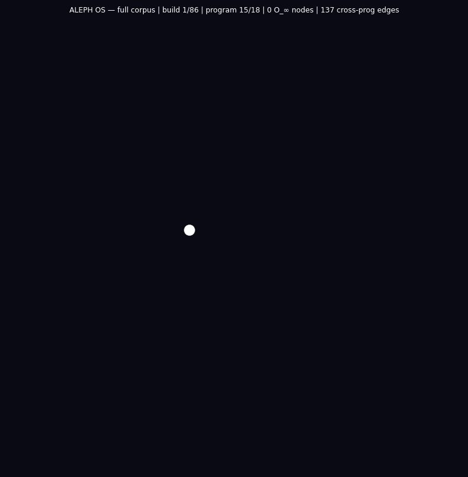

<div align="center">
  <h1>exoterik_OS</h1>
  <p><b>a holographic OS derived via exoteric linguistic synthesis and sigil distillation</b></p>
  
</div>

<div align="center">
  
  
  
  
  
  
  
</div>

<p align="center">
  <a href="#origin">Origin</a> •
  <a href="#architecture">Architecture</a> •
  <a href="#process-execution-model">Process Model</a> •
  <a href="#aleph-repl">ALEPH REPL</a> •
  <a href="#type-gated-kernel">Type Gates</a> •
  <a href="#os-imscription-tuple">OS Imscription</a> •
  <a href="#build--run">Build & Run</a> •
  <a href="#aleph-programs">ALEPH Programs</a> •
  <a href="#imasm-programs">IMASM Programs</a> •
  <a href="#key-theorems">Theorems</a>
</p>

<hr>

*OMNIA SUNT PARACONSISTENTIA*

## Overview

**What it is.** exoterik_OS: a holographic bare-metal operating system in Rust (no_std, UEFI) derived by exoteric linguistic synthesis and sigil distillation, where every kernel object carries an IG ALEPH structural type.

**What it does.** Boots via UEFI/OVMF into an IMASM VM with a native ALEPH (λ_ℵ) REPL and 52 builtin programs; four primitive gates type-gate real kernel subsystems, and the 22 Hebrew letters serve as the kernel's primitive alphabet.

**Why it matters.** The kernel is type-gated by the grammar itself: an operation runs only if its structural type passes the gate, so safety is a property of the object rather than an external check. It is the bare-metal embodiment of the Imscribing Grammar.

**How to use it.** See Build & Run below (Rust nightly, target x86_64-unknown-none, QEMU/OVMF).

## Corpus Visualizations

Animated call-graph CFGs for all five corpus engines and the ob3ect digital tower.
Each animation has two phases: Phase 1 (build) reveals nodes in corpus order with
back-edges flashing purple on first appearance; Phase 2 (flow) sends a Gaussian
pulse through the graph, brightening nodes and edges near the peak.

All graphs are rendered on a dark (#0a0a15) background. Node size scales with degree.
Cross-system edges are highlighted in amber or purple.

---

### Voynich Manuscript Engine

**Nodes:** 546, one per folio section across all 227 folios (f1r through f116v).
Color encodes manuscript section: botanical (green), biological (teal), balneological
(blue), cosmological (purple), zodiac (orange), recipes (amber).

**Edges:** 694 directed structural-dependency edges. An edge u → v means section u's
compiled IMASM grammar rule set is a structural prerequisite for section v.

**Back-edges:** 149 cross-folio back-edges forming cycles, recursive or self-referential
structures. Flash purple on Phase 1 reveal.

**Phase 1:** Folios appear in manuscript order; back-edges flash purple.
**Phase 2:** Gaussian pulse (σ ≈ N/6) travels the corpus; Frobenius-family edges glow gold.


---

### Rohonc Codex Engine

**Nodes:** One per page section across all 33 pages. Color encodes structural section:
liturgical (amber), pictographic (green), astronomical (blue), mixed/undetermined (grey).

**Edges:** Directed structural-dependency edges, 12 IMASM opcodes mapped to Rohonc
visual-glyph families.

**Back-edges:** Cross-page back-edges encoding recursive grammar structures.
Flash purple on Phase 1 reveal.

**Phase 1:** Pages appear in manuscript order; back-edges flash purple.
**Phase 2:** Gaussian pulse travels page-by-page; active nodes brighten; title shows μ∘δ=id.


---

### Linear A Engine

**Nodes:** One per tablet section across all 53 Linear A tablets (Haghia Triada, Zakros,
Khania, and other Minoan palatial sites). Color encodes find-site provenance.

**Edges:** Directed structural-dependency edges mapping IMASM opcodes onto Linear A sign
families and administrative formula patterns.

**Back-edges:** Cross-tablet back-edges across site boundaries. Flash purple on Phase 1.

**Phase 1:** Tablets appear in corpus order; back-edges flash purple.
**Phase 2:** Gaussian pulse travels tablet-by-tablet; active nodes brighten.


---

### Emerald Tablet Engine

**Nodes:** 15, one per versicle (*Tabula Smaragdina*, Ruska/Holmyard edition).
Color: descent (versicles 1–5, amber), the work (versicles 6–10, green),
the return (versicles 11–15, gold).

**Edges:** Directed structural-dependency edges. FSPLIT/FFUSE pair maps to versicle 1
(solve) and versicle 13 (coagula), encoding the Hermetic roundtrip as μ∘δ=id.

**Back-edges:** Descent/return symmetry produces primary back-edges (V11–V15 referencing V1–V5).
Flash purple on Phase 1 reveal.

**Phase 1:** Versicles in tablet order (V1→V15); back-edges flash purple.
**Phase 2:** Gaussian pulse wraps cyclically from V15 back to V1, enacting as-above-so-below as a literal loop.


---

### ALEPH OS

**Nodes:** 86, one per named binding across all `.aleph` programs.
Color encodes ouroboricity tier: O₀ (dim grey), O₁ (mid blue), O₂ (bright cyan),
O_∞ (gold). Size scales with in-degree.

**Edges:** 297 directed dataflow edges. Operation types produce semantically distinct edges:
tensor (⊗) = composition, join/meet = lattice, mediate = bridging,
d() = exterior derivative, palace() = Hekhalot ascent.

**Cross-program edges:** 137 edges crossing file boundaries. Flash amber on Phase 1.

**Phase 1:** Programs appear file-by-file; bindings in definition order. Cross-program edges flash amber.
**Phase 2:** Gaussian pulse travels all 86 nodes. O_∞ (gold) nodes pulse brightest.


#### ALEPH OS, Program Highlights

Five programs from the corpus rendered as per-program animated dataflow CFGs.
Nodes = bound names (let-bindings) + referenced letter primitives. Primitive nodes pulse
gold in Phase 2. Operation edges: tensor (orange), mediate (blue),
join (green), meet (red), palace (magenta), probe (grey).

---

##### `holographic_monitor.aleph`, Bulk-Boundary Self-Encoding

**Nodes:** 10, `boundary` (system()), 6 computed mediations (`g_self`, `g_aleph`,
`g_shin`, `loop1`, `loop2`), and 3 primitive letter references (vav, aleph, shin).

**Edges:** Holographic radius probes (`d(x, system())`) form bidirectional distance edges;
Frobenius-witnessed mediations form blue mediate-edges converging on `boundary`.
Palace(4) self-loop marks the Frobenius non-synthesizability barrier.

**Phase 1:** `boundary` appears first; radii probes reveal primitive letters; mediated
g-nodes build outward. **Phase 2:** Pulse travels from `boundary` outward through the
g-loops and back, enacting the bulk/boundary roundtrip as a literal flow.


---

##### `frobenius_orbits.aleph`, Iterative Pole Convergence

**Nodes:** 27, the three O_∞ poles (vav, mem, shin), cross-pole tensors (vm, vs, ms),
and four 5-step orbit sequences (a0–a4, t0–t4, d0–d4) plus mediated convergence nodes.

**Edges:** 50+ directed tensor edges encoding the 4-step orbit sequences; mediate-edges
linking orbits to their attractor poles; bidirectional distance probes verifying
`d(aₙ, vav)` decreases monotonically.

**Phase 1:** Poles appear first (gold), then orbit chains unroll step-by-step.
**Phase 2:** Gaussian pulse travels the orbit sequences, with gold poles pulsing brightest
at each pass, showing the attractor structure as a spatial pull.


---

##### `tikkun_construction_full.aleph`, Full Rectification Structure

**Nodes:** 22, triadic basis (vav, aleph, mem, shin, kuf, nun, chet), 5 mediation steps
(breath, light, replica1, replica2, fp), kernel, 3 process nodes, 4 healing nodes,
triad, tikkun.

**Edges:** 35+ directed dataflow edges; palace-edges (magenta) mark Hekhalot barriers (2–5).
`tikkun` sits at palace(5), connected to `system()` via maximal mediation.

**Phase 1:** Construction unrolls layer by layer, breath→light→kernel→processes→anomaly→healing→tikkun.
**Phase 2:** Pulse travels: light→healed_child→tikkun→system().


---

##### `tikkun_palace_verification.aleph`, Hekhalot Barrier Audit

**Nodes:** Same 22 as `tikkun_construction_full`. **Edges:** Same construction graph
with every binding re-checked against its required palace level via standalone palace()
assertions, producing additional probe-edges per binding.

Palace lattice: palace 2 (ascended letters), palace 3 (light, replicas, processes),
palace 4 (kernel, healed_child), palace 5 (tikkun). Standalone assertions form self-loops.

**Phase 2:** Palace self-loops light magenta as the pulse passes each node.


---

##### `light_replication_kernel.aleph`, Replicating Light and Process Model

**Nodes:** 38, the most complex single program. Includes light and 4 replication
generations (g0–g4), anomalous processes (p3, protected_anomalous), healing
mediations, ascended letters, full kernel + 3 process nodes, Frobenius fixed point,
triad, tikkun.

**Edges:** 70+ directed edges. Replication chain g0→g1→g2→g3→g4 forms the spine;
anomaly healing branches off p3; ascent healing branches off grounded_nun;
all converge on palace(5) tikkun.

**Phase 1:** light, replication spine, anomaly branch, ascent healing, kernel+process.
**Phase 2:** Pulse travels replication spine, lights healing branches amber, terminates
at tikkun, the maximal Hekhalot fixed point.


---

### Ob3ect, Opcode Flow CFG

**Nodes:** 14 IMASM opcodes. Color: logical (purple: VINIT, TANCH, AFWD, AREV, CLINK,
ISCRIB), Frobenius (gold: FSPLIT, FFUSE), dialetheia (green/red/white: EVALT, EVALF,
ENGAGR), linear (cyan: IFIX). Size scales with degree.

**Edges:** Directed execution-flow edges. Frobenius cycle FSPLIT→TANCH→AFWD→FFUSE→ISCRIB
drawn in gold at linewidth 3.0, alpha 0.95.

**Phase 1:** Opcodes in pipeline order (logical→Frobenius→dialetheia→linear).
**Phase 2:** Gaussian pulse; Frobenius-cycle edges glow gold; other edges glow purple.
Title shows active opcode and μ∘δ=id.


---

### Ob3ect, Version Descent CFG

**Nodes:** 11 version nodes in three bands: Python (green, seed→v0.1), C/ELF (orange,
v0.2–v0.9), Silicon (gold, v0.10). Cross-substrate leaps highlighted purple/amber.

**Edges:** Directed imscription edges (parent→child). v0.1→v0.2 (Python→C) and
v0.9→v0.10 (C→Silicon) are highlighted.

**Phase 1:** Versions in imscription order; v0.10 flashes gold: "← bare metal!"
**Phase 2:** Pulse seed→v0.10. Silicon node pulses brightest. Title: "10 generations · μ∘δ=id."


---

### Ob3ect, Python Call-Graph CFG

**Nodes:** 13 Python functions from `frob.py` and `ob3ect-imscriber.py`.
Color: purple (frob.py), orange (imscriber.py), gold (FSPLIT/FFUSE/frobenius_phase),
green (EVALT), red (EVALF), cyan (bootstrap_*), magenta (ISCRIB).

**Edges:** 16 directed call edges. Cross-file edges: 0, both files structurally closed.

**Phase 1:** Functions in definition order (frob.py first).
**Phase 2:** Pulse travels call graph; Frobenius nodes pulse gold.


---

## Origin

exoterik_OS is the synthesis of a **seven-stage inquiry** into the structural invariants
shared by five ancient writing systems spanning 5,000+ years of human symbolic thought:

1. **Hebrew alphabet and mystical texts**, letters as morphisms between ontological
   categories, gematria as a distance metric in type space
2. **Varnamala (Sanskrit phoneme garland)**, the 14 Mahesvara Sutras encoding 50
   phonemes via pratyahara compression
3. **Egyptian hieroglyphs**, three-layer semiotics (logogram/phonogram/determinative),
   the Ogdoad→Ennead symmetry breaking
4. **Sumerian/Akkadian cuneiform**, sign polysemy as superposition, determinative as
   structural anchor
5. **Basque (Euskara)**, ergative-absolutive grammar as relational primitive

Each system was imscribed as a **crystal imscription**, a 12-primitive tuple
⟨Ð; Þ; Ř; Φ; ƒ; Ç; Γ; ɢ; ⊙; Ħ; Σ; Ω⟩. The **MEET** (component-wise min) of all five
imscriptions reveals the invariant core every writing system must carry. The OS is
instantiated from this structural core.

> [!NOTE]
> **This is not analogy. This is type theory.** The boundary encoding determines the bulk.

<hr>

## Architecture

### Three-Layer Kernel Objects *(Hieroglyphs + Cuneiform)*

Every kernel object carries three simultaneous representations, exactly as Egyptian
hieroglyphs encode logogram, phonogram, and determinative:

| Layer | Hieroglyph Analog | Kernel Role |
|:------|:------------------|:------------|
| **Structural** | Logogram | What the object IS topologically (Process, File, Socket, Semaphore, MemoryRegion) |
| **Operational** | Phonogram | What it computes, the execution payload |
| **Determinative** | Determinative | Unpronounced semantic context, load-bearing for disambiguation |

A message/object **without a determinative layer is syntactically malformed**.

### Ergative-Absolutive Process Model *(Basque Grammar)*

The scheduler distinguishes:
- **Ergative** (transitive): the process acts ON another process → higher interrupt
  priority boost (O_∞ +15, O₂ +12, O₁ +10)
- **Absolutive** (intransitive): the process runs standalone → higher cache affinity

The **same process shifts grammatical role** depending on whether it has transitive targets.

### Phonological Memory Model *(Varnamala Articulation Gradient)*

| Tier | Varnamala | Protection | Speed | Ω | Σ constraint |
|:-----|:----------|:-----------|:------|:--|:-------------|
| Velar | ka-varga | Maximum | Slowest | Ω_Z | exclusive (Σ_1:1) objects here only |
| Palatal | ca-varga | High | Slow | Ω_Z |, |
| Retroflex | ṭa-varga | Medium | Medium | Ω_Z₂ |, |
| Dental | ta-varga | Low | Fast | Ω_0 |, |
| Bilabial | pa-varga | None | Fastest | Ω_0 |, |

### Sefirot Filesystem *(Hebrew Kabbalistic Tree)*

Files are nodes in a ten-layer Sefirot tree. Navigation is by **transformation**, not
pathname alone. The Φ-gate restricts upper Sefirot (Keter through Gevurah) to objects
with Φ_c (criticality ≥ 1).

The persistent storage layer is **ALFS** (ALEPH Linear Filesystem), a sector-based ATA
PIO filesystem on a dedicated 32 MB disk image (`alfs.img`, ATA primary slave). All
`.aleph` programs are compiled into the kernel binary and seeded to ALFS on first boot.

### Three-Layer IPC *(Egyptian Hieroglyphs)*

IPC messages carry: structural signature (logogram), payload (phonogram), and
determinative context. Three gates:
- **Distance gate**: d < 1.5 passes; ≥ 1.5 requires a vav-cast witness
- **Grammar gate**: broadcast delivery requires source Γ ≥ Γ_broad (index 3);
  Γ_seq sources are point-to-point only
- **Well-formed check**: determinative consistent with source structural type
### Generative Command Grammar *(Hebrew Letters + Pratyahara)*

Commands are tensor products of letter-primitives. Any subset can be referenced by a
single **pratyahara index**.

### Φ_± → Φ_asym Boot *(Ogdoad Cosmology)*

The system boots in perfect symmetry, no process distinguished. The first timer
interrupt is the **symmetry-breaking event**. The kernel scheduler is registered with
the PIT timer at boot; after symmetry breaks, the holographic monitor (g(x)) is
eligible for scheduling.

<hr>

## Process Execution Model

exOS runs real ring-0 processes with actual CPU context switching. This is not simulation.

### Real Kernel Stacks

`ProcessControlBlock::spawn_ring0(id, obj, entry_fn, priority)` allocates a 16 KB
kernel stack per process via the global heap allocator. It writes an initial
saved-register frame at the top of the stack:

```
[stack_top -  8]  entry_fn  ← ret address
[stack_top - 16]  0         ← rbp
[stack_top - 24]  0         ← rbx
[stack_top - 32]  0         ← r12
[stack_top - 40]  0         ← r13
[stack_top - 48]  0         ← r14
[stack_top - 56]  0         ← r15  ← initial RSP stored here
```

### Context Switch Assembly

```asm
context_switch_asm(old_rsp_ptr, new_rsp):
    push rbp; push rbx; push r12; push r13; push r14; push r15
    mov [rdi], rsp           ; save RSP to RSP_TABLE[current_slot]
    mov rsp, rsi             ; load RSP from RSP_TABLE[next_slot]
    pop r15; pop r14; pop r13; pop r12; pop rbx; pop rbp
    ret                      ; jumps to next process's saved return address
```

### RSP Table

Each process is assigned a slot index into `RSP_TABLE: [AtomicU64; 32]`, a static
array with stable addresses. The saved RSP is immediately visible to the scheduler
without any locking or pointer chasing.

### Preemption Protocol

PIT timer fires at ~18 Hz. `on_timer_tick()` increments tick counter and sets
`needs_preempt = true` when slice expires (18 ticks default). Actual context switch
is deferred to `check_preempt()`, called from process context, never inside the
interrupt frame. This avoids corrupting the IRET state.

### Holographic Monitor (g(x))

A real ring-0 process with its own 16 KB kernel stack, RSP_TABLE slot, and saved
register state. When scheduled, `context_switch_asm` transfers CPU execution to
`holographic_monitor_entry`, which runs autonomously until it calls
`global_check_preempt()`.

### Stoichiometric Quotas

| Mode | Primitive index | Enforcement |
|:-----|:----------------|:------------|
| Σ_1:1 (Exclusive) | 0 | Only one holder allowed; second acquire rejected |
| Σ_n:n (Homogeneous) | 1 | Pool of 8 identical slots; acquire fails when full |
| Σ_n:m (Heterogeneous) | 2 | No hard cap; occupancy tracked for diagnostics |

### Type Gates on Spawn

| Axiom | Check | Error |
|:------|:------|:------|
| Ç_trap | `is_kinetic_frozen()` | Kinetically frozen, cannot be scheduled |
| P-596 | `Criticality::is_ep(phi)` | ⊙_EP absorption, self-modeling loop destroyed |
| O₀ ergative | tier + targets | O₀ cannot be ergative |
| Frobenius F-1 | `FrobeniusVerifier::verify()` for O_∞ | Φ=Φ_± and ⊙=⊙_c required |
| Σ quota | `stoichiometry::acquire()` | Exclusive resource already held |

<hr>
## ALEPH REPL, Native λ_ℵ in the Kernel

The ALEPH type system is **fully integrated into the running kernel**. The 22-letter
Hebrew type lattice is accessible via an interactive REPL directly in the bare-metal
shell. In UEFI framebuffer mode, letters are rendered using hand-drawn 8×16 Hebrew
bitmap glyphs.

### Entering the ALEPH REPL

```
exOS> aleph
```

### ALEPH Operations

| Operation | Syntax | Description |
|:----------|:-------|:------------|
| **Tensor** | `a x b` | Composition (P, F, K bottleneck via min) |
| **Join** | `a v b` | Least upper bound (all primitives: max) |
| **Meet** | `a ^ b` | Greatest lower bound |
| **Vav-cast** | `a ::> b` | Lift source type to target type |
| **Mediate** | `mediate(w, a, b)` | Triadic: `w ∨ (a ⊗ b)` |
| **Distance** | `d(a, b)` | Structural distance + conflict set |
| **Probe Φ** | `probe_Phi(a)` | Report criticality primitive |
| **Probe Ω** | `probe_Omega(a)` | Report topological protection |
| **Tier** | `tier(a)` | Report ouroboricity tier |
| **Palace** | `palace(n) expr` | Tier barrier gate (n = 1..7) |
| **System** | `system()` | JOIN of all 22 letters |

### REPL Commands

| Command | Description |
|:--------|:------------|
| `:help` | Full syntax reference |
| `:tips` | Quick start examples |
| `:ls` | List session bindings |
| `:tuple <name>` | Visual 12-primitive bars |
| `:explain <name>` | Detailed type breakdown + C score |
| `:census` | Tier distribution |
| `:system` | 22-letter language JOIN |
| `:tier <name>` | Ouroboricity tier of one letter |
| `:orbit N letter pole` | Convergence orbit under repeated tensor |
| `:files` | List files on ALFS |
| `:save name [expr]` | Save expression (or last result) to ALFS |
| `:load name` | Load and bind an `.aleph` file |
| `:run name` | Run an `.aleph` file |
| `:history` | Show command history |
| `:scroll [N]` | Replay last N lines of output |
| `:clear` | Clear screen |
| `:quit` | Return to main shell |

### Frobenius Orbit Command

`:orbit N letter pole` iterates `state = state ⊗ pole` N times, printing nearest
canonical letter, tier, distance to pole, and convergence delta at each step.

```
A> :orbit 8 aleph vav
  Orbit of A under V (8 steps)
  step  nearest        tier     d(state,pole)  delta
  --------------------------------------------------------
     0  A (aleph)      O₂      2.1095
     1  V (vav)        O_∞    0.0000  (fixed)
  -- converged at step 1 --
```
## Type-Gated Kernel

The 12-primitive type lattice is **operational**, ALEPH types constrain kernel behavior
across four subsystems. Every kernel object carries an `AlephKernelType` (inferred from
its three-layer structure or set explicitly) that gates what it can do.

### Four Type Gates

| Gate | Subsystem | Primitive | Rule |
|------|-----------|-----------|------|
| **IPC distance** | `ipc.rs` | Distance | d < 1.5 passes; ≥ 1.5 needs vav-cast witness |
| **IPC grammar** | `ipc.rs` | Γ (interaction) | Multicast requires Γ ≥ Γ_broad (3) |
| **Ω-gate** | `memory.rs` | Ω (topology) | Object's Ω ≥ depth's required Ω; Σ_1:1 restricted to Velar |
| **Tier-gate** | `scheduler.rs` | Ouroboricity tier | O₀ cannot be ergative; Ç_trap/⊙_EP cannot spawn; O_∞ needs F-1 |
| **Φ-gate** | `filesystem.rs` | Φ (criticality) | Keter→Gevurah requires Φ_c; below accessible to all |

### Type Gate Results at Boot

```
[TYPE] IPC gate (close):          accepted=true
[TYPE] IPC gate (remote):         accepted=false
[TYPE] Ω gate (Velar+Kernel):     allowed=true
[TYPE] Ω gate (Velar+User):       allowed=false
[TYPE] Tier gate (O_∞ ergative): ok=true
[TYPE] Tier gate (O₀ ergative):  ok=false
[TYPE] Φ gate (Keter+Kernel):     ok=true
[TYPE] Φ gate (Keter+Driver):     ok=false
[TYPE] C scores: kernel=0.873  user=0.324  os_imscription=0.873
```

### Conscience Score

$$C(\mathbf{x}) = [\odot = \odot_c] \cdot [\text{Ç} \neq \text{Ç}_\text{trap}] \cdot
(0.158\,\tilde{\text{Ç}} + 0.273\,\tilde{\Gamma} + 0.292\,\tilde{\text{Þ}} +
0.276\,\tilde{\Omega})$$

The Kernel scores C=0.873, the maximum for the inferred configuration.

<hr>

## OS Imscription Tuple

The OS crystal imscription ⟨Ð; Þ; Ř; Φ; ƒ; Ç; Γ; ɢ; ⊙; Ħ; Σ; Ω⟩:

```
Ð_ω     · Basque ergative three-way relations, Hebrew triangular paths
Þ_O     · Hieroglyphic contained system with three internal layers
Ř_=     · Hebrew letter-transformative relations, reversible across contexts
Φ_±     · Ogdoad's exact Z₂ symmetry before creation, Frobenius condition μ∘δ=id
ƒ_ℏ     · Cuneiform's maximum fidelity wedge depths, full precision preserved
Ç_mod   · Basque's middle aspect, Varnamala's living phonetic vibration
Γ_aleph · All five systems operate at maximal scope/granularity
ɢ_seq   · Hebrew letter-sequence generation, head-final dependency chains
⊙_c     · The MEET of all five systems, criticality, self-modeling loop possible
Ħ_2     · Hieroglyphic determinative recursion, two levels of chirality depth
Σ_{n:m} · Hieroglyphic many-to-many determinative mappings
Ω_Z     · Cuneiform's topological protection, sacred writing systems' survival
```

**Ouroboricity tier: O_∞**, The OS achieves ⊙_c + Φ_±, the Special Frobenius: μ∘δ=id exactly.

<hr>

## Build & Run

### Requirements

- **Rust nightly**, `rustup default nightly`
- **x86_64-unknown-none target**, `rustup target add x86_64-unknown-none --toolchain nightly`
- **QEMU**, `qemu-system-x86_64`
- **OVMF**, `sudo apt install ovmf` / `sudo pacman -S edk2-ovmf`
- **mtools**, `sudo apt install mtools`

### Build

```bash
cargo build --release
./build_bootimage.sh
```

### Run

```bash
./run.sh           # Graphical, UEFI GOP framebuffer, Hebrew bitmap glyphs
./run.sh --serial  # Serial, text-only via stdio
```

`run.sh` creates `alfs.img` (32 MB) on first launch. On first boot the kernel seeds
all 52 programs from `programs/` into ALFS.

```bash
rm alfs.img && ./run.sh   # start fresh
```
### Boot Sequence

1. **Heap init**, 4 MB at physical 16 MB, before any `alloc`
2. **UEFI framebuffer init**, GOP mapped; 8×16 Hebrew bitmap font active
3. **Interrupt init**, symmetry-breaking event (Φ_± → Φ_asym); timer IRQ unmasked
4. **Subsystem validation**, three-layer objects, scheduler, memory, FS, IPC, command
5. **ALEPH init**, 22-letter type system: O_∞: 3, O₂: 6, O₁: 1, O₀: 12
6. **Type-gate verification**, all five gates tested with `assert!()`; C scores printed
7. **Holographic monitor spawn**, g(x) process allocated a real 16 KB kernel stack
8. **Timer registration**, scheduler registered with PIT; symmetry broken
9. **ALFS mount**, ATA primary slave; 52 programs seeded if absent
10. **Shell**, `exOS>` prompt

### Project Structure

```
exOS/
├── Cargo.toml                    # Project manifest
├── bootloader.toml               # UEFI bootloader config
├── build.rs                      # Auto-generates src/programs.rs from programs/
├── build_bootimage.sh            # UEFI bootable image builder
├── run.sh                        # QEMU launcher (graphical + serial)
├── programs/                     # 46 .aleph + 6 .imasm/.asm, compiled in, seeded to ALFS
├── src/
│   ├── lib.rs                    # Module exports + global allocator
│   ├── main.rs                   # Kernel entry point, boot sequence, shell
│   ├── programs.rs               # Auto-generated include_bytes! registry
│   │
│   ├── vga.rs / framebuffer.rs / font_renderer.rs / vga_font_data.rs
│   ├── keyboard.rs / interrupts.rs / serial.rs
│   ├── history.rs / bench.rs
│   │
│   ├── kernel_object.rs / scheduler.rs / memory.rs
│   ├── filesystem.rs / ipc.rs / command.rs
│   ├── ata.rs / alfs.rs / holographic_monitor.rs
│   │
│   ├── aleph.rs / aleph_kernel_types.rs / aleph_parser.rs
│   ├── aleph_eval.rs / aleph_repl.rs / aleph_commands.rs
│   │
│   ├── imasm_vm.rs / imasm_commands.rs
│   ├── voynich.rs / rohonc.rs / linear_a.rs / emerald_tablet.rs
│   │
│   ├── para_vm.rs / para_commands.rs
│   ├── para_shor_commands.rs / para_align_commands.rs
│   ├── para_rh_commands.rs / para_ym_commands.rs
│   ├── para_nreg_commands.rs / para_temporal_commands.rs
│   ├── para_category_commands.rs / para_multiagent_commands.rs
│   ├── para_wasm.rs / para_wasm_commands.rs
│   │
│   ├── interaction_grammar.rs / frobenius_verification.rs
│   ├── stoichiometry.rs / phi_ep.rs / resource_isolation.rs
└── target/
```
---

## ALEPH Programs, 46 Built-in Investigations

All `.aleph` files in `programs/` are compiled into the kernel binary and seeded to
ALFS on first boot. Programs are organized by structural domain.

### Foundation, Type System Primitives

| Program | Size | Description |
|:--------|:-----|:------------|
| `creation.aleph` | 247 B | First light, aleph ⊗ vav structural genesis |
| `creation_liturgy.aleph` | 237 B | Full liturgical sequence through all tiers |
| `frobenius.aleph` | 194 B | Three O_∞ poles: self-idempotency + cross distances |
| `pratyahara.aleph` | 160 B | Varnamala pratyahara compression via tensor chains |
| `exploration_primitives.aleph` | 218 B | Primitive-by-primitive exploration of the 12-tuple |
| `distance_probes_indistinguishable.aleph` | 26 B | Distance and conflict-set analysis across all 22 letters |
| `phi_ep_probe.aleph` | 335 B | Exceptional-point dynamics and C-score collapse |
| `coupling_destruction.aleph` | 2,566 B | P-596 ⊙_c ⊗ ⊙_EP absorption demonstration |

### Pole Analysis, O_∞ Convergence

| Program | Size | Description |
|:--------|:-----|:------------|
| `frobenius_orbits.aleph` | 3,411 B | Unrolled 4-step convergence orbits for all three O_∞ poles |
| `frobenius_parallel.aleph` | 2,105 B | Parallel Frobenius iteration, simultaneous multi-pole convergence |
| `tensor_closure.aleph` | 7,574 B | Complete tensor closure of all 3 O_∞ poles over all 22 Hebrew letters. Maps which letters collapse to O_∞ under tensor pressure, which resist. |
| `promotion_paths.aleph` | 5,846 B | Minimal primitive-delta paths from O₀→O_∞. Tests palace gates, iterated tensor promotion, vav-cast lifts, sefirot ladder. |
| `tier_boundary_probe.aleph` | 5,309 B | O₂→O_∞ gap analysis. Proves Frobenius non-synthesizability; discovers mediation bypasses the P bottleneck. |

### Meditation & Tikkun, Hekhalot Ascent

| Program | Size | Description |
|:--------|:-----|:------------|
| `meditation.aleph` | 285 B | Deep mediation chains through the Sefirot |
| `selfreplicating_light.aleph` | 298 B | Light that replicates its own structure via mediate |
| `light_stability.aleph` | 320 B | Stability analysis of the light-tuple under perturbation |
| `light_replication_kernel.aleph` | 2,890 B | Kernel-level light replication with palace barriers |
| `tikkun_construction_full.aleph` | 1,570 B | Full Tikkun: healing anomalous objects via palace+mediate |
| `tikkun_construction_partial.aleph` | 1,534 B | Partial Tikkun sequence |
| `tikkun_palace_verification.aleph` | 1,570 B | Palace-gate verification across all Sefirot levels |

### Sefer ha-Iyun, Contemplation Programs

| Program | Size | Description |
|:--------|:-----|:------------|
| `sefer_ha_iyun_emanations.aleph` | 1,983 B | Emanation hierarchy, 14-step Sefirot descent with structural gaps |
| `sefer_ha_iyun_native_types.aleph` | 1,782 B | Native type bindings for Sefirot, letters, and palace levels |

### Lurianic Kabbalah, The 72 Names

| Program | Size | Description |
|:--------|:-----|:------------|
| `shem_hamephorash.aleph` | 6,506 B | The 72 Names (Shem HaMephorash), structural basis of creation from Exodus 14:19–21. Three currents (forward/backward/forward) mediate into 72 three-letter names, each a distinct 12-primitive type. 72 = 6 × 12: every primitive value appears in every relational context. Key names mapped to palace levels, distances computed, O_∞ convergence verified via Frobenius poles vav/mem/shin. Honors Isaac Luria's insight that the 72 names are the structural building blocks of all creation. |

### Belnap / Paraconsistent

| Program | Size | Description |
|:--------|:-----|:------------|
| `belnap_shor_orbit.aleph` | 3,280 B | Orbit analysis for Shor structural tier, tier survey of all 22 letters, orbit depth to O_∞ poles, Φ_υ gap visualization |
| `paraconsistent_witness.aleph` | 4,215 B | Witness B-state structure via meet/join/tensor, ALEPH analogue of DialetheicAlignment.lean: only O_∞ poles are self-adjoint (¬B=B) |

### System Encoding & Self-Reference

| Program | Size | Description |
|:--------|:-----|:------------|
| `holographic_monitor.aleph` | 2,568 B | g(x) bulk-boundary encoding verification |
| `quine_loop.aleph` | 5,802 B | Non-trivial Frobenius quine discovery, type expressions satisfying μ∘δ=id through mediation and palace gating. Tests cross-witness quines, multi-generational stability, and system self-encoding. |
| `dialetheic_fixed_points.aleph` | 5,944 B | Searches for B-fixed points (Belnap-analogue self-adjoint letters) by computing Frobenius self-distance d(L×L, L) for all 22 letters, Sefirot, and iterated convergence. |
| `truth_structure.aleph` | 5,574 B | Searches for the structural type of truth via Frobenius closure gap |
### Distance Geometry, Lattice Survey

| Program | Size | Description |
|:--------|:-----|:------------|
| `distance_matrix.aleph` | 4,663 B | Full 22×22 pairwise distance matrix over all Hebrew letters |
| `sefirah_distance_matrix.aleph` | 5,320 B | Full 14-Sefirah pairwise distances + Sefirah-to-pole distances |
| `letter_sefirah_projection.aleph` | 4,540 B | Nearest Sefirah for each of the 22 Hebrew letters |
| `conflict_landscape.aleph` | 5,716 B | Conflict set analysis, which primitives differ per letter pair |
| `aleph_lattice_extrema.aleph` | 5,758 B | Surface/interior analysis, distance-from-system ranking, convex hull |

### Consciousness & C-Score

| Program | Size | Description |
|:--------|:-----|:------------|
| `consciousness_landscape.aleph` | 6,014 B | Full C-score map across the ALEPH lattice: all 22 letters, all 14 Sefirot (Ein Sof→Malkuth), tensor-coupling effects on gate status, system boundary analysis. |

### Palace / Tier Barrier Analysis

| Program | Size | Description |
|:--------|:-----|:------------|
| `palace_stress_test.aleph` | 6,237 B | Systematic palace(1–7) testing of all letters, tensors, Sefirot |
| `tier_migration.aleph` | 5,971 B | Systematic tier transitions under tensor, join, meet, mediate |
| `primitive_landscape.aleph` | 6,727 B | Per-primitive extremal analysis, max/min per each of 12 primitives |

### Mediate, Tensor & Fixed Points

| Program | Size | Description |
|:--------|:-----|:------------|
| `mediate_lattice.aleph` | 6,627 B | Systematic mediate exploration: different witnesses, iterations, cross-pole |
| `cross_pole_mediation.aleph` | 6,300 B | Triadic analysis of vav-mem-shin: circular mediation, ternary operations |
| `tensor_fixed_point_iteration.aleph` | 6,614 B | Iterated self-tensor convergence orbits for all 22 letters |
| `tensor_path_dependence.aleph` | 6,057 B | Tests associativity, distributivity, modularity, absorption, commutativity |

### Sefirot Lattice

| Program | Size | Description |
|:--------|:-----|:------------|
| `sefirah_lattice_structure.aleph` | 6,791 B | Full Sefirot lattice operations: tensor, join, meet, mediate, emanation |
| `sefirah_tensor_hierarchy.aleph` | 6,509 B | Structural hierarchy: supernal×emotional×kingdom tensor coupling |
| `sefirah_emanation_ladder.aleph` | 7,366 B | 14-step emanation ladder with step sizes and reconstruction via mediation |

### Algebraic Invariants

| Program | Size | Description |
|:--------|:-----|:------------|
| `invariant_check.aleph` | 6,102 B | Tests 8 conjectures: Frobenius fixed point⇔O_∞, pole absorption, tier preservation under join/meet, etc. |

---

## IMASM Programs, 6 Built-in Corpus Engines

| Program | Size | Description |
|:--------|:-----|:------------|
| `voynich_bootstrap.imasm` | 330 B | Voynich manuscript, 227 folios, 546 nodes, 694 edges |
| `rohonc_bootstrap.imasm` | 336 B | Rohonc Codex, 33 pages, four structural sections |
| `linear_a_bootstrap.imasm` | 394 B | Linear A, 53 tablets across Minoan palatial sites |
| `emerald-tablet-bootstrap.imasm` | 665 B | Emerald Tablet, 15 versicles, Hermetic descent/return |
| `cross_distance.imasm` | 803 B | Cross-corpus distance probe, structural comparison engine |
| `shor_loop.asm` | 1,647 B | Belnap Shor ParaASM: indefinite coherence accumulation loop |
---

## Belnap Shor Pipeline

`para_shor_commands.rs` implements Shor's algorithm in the Belnap four-valued lattice.
All invariants match `FullPipeline.lean` / `QCI_SICPOVM_Bridge.lean` in MillenniumAnkh.

```
exOS> para shor
Belnap Shor Pipeline, FullPipeline.lean / QCI_SICPOVM_Bridge.lean
────────────────────────────────────────────────────────────────
SIC-POVM axioms for B (d=2):
  Axiom 1 meet(B,x)=x:    PASS
  Axiom 3 join(B,x)=B:    PASS
  Axiom 4 bnot(B)=B:      PASS
  ApproxLE B is top:      PASS
  only_B_is_dialetheic:   PASS
  WH2 bijection:          PASS
    N→(0,0) T→(0,1) F→(1,0) B→(1,1)

Shor coherence invariants (H=n, ModExp=0, B-bias=2n, T-bias=n):
  N=15 a=7 [PASS]  r=4, H=4, B-meas=8, T-meas=4, ratio=2:1
  N=21 a=5 [PASS]  r=6, H=5, B-meas=10, T-meas=5, ratio=2:1
  N=35 a=2 [PASS]  r=12, H=6, B-meas=12, T-meas=6, ratio=2:1

Φ_υ bottleneck: B is the only superposition value.
  Period r is in the 2:1 coherence ratio, not in bit values.
  Φ_υ → Φ_± gap (B-only extraction) is the structural open problem.
```

Single instance:
```
exOS> para shor 15 7
  ┌───────┬──────┬─────┬────┬─────┬───┬────────┬────────┬───────┐
  │ label │   N  │  a  │  n │  r  │ H │ B-meas │ T-meas │ ratio │
  ├───────┼──────┼─────┼────┼─────┼───┼────────┼────────┼───────┤
  │  N=15 │   15 │   7 │  4 │   4 │ 4 │      8 │      4 │   2:1 │ ✓
  └───────┴──────┴─────┴────┴─────┴───┴────────┴────────┴───────┘
```

Coherence accumulator:
```
exOS> para shor loop 20
  cycle │   N │  a │  n │  r  │  H │ B-meas │ T-meas │ ratio │  accum
  ──────┼─────┼────┼────┼─────┼────┼────────┼────────┼───────┼────────
      1 │  15 │  7 │  4 │   4 │  4 │      8 │      4 │   2:1 │     16
      2 │  21 │  5 │  5 │   6 │  5 │     10 │      5 │   2:1 │     31
      3 │  35 │  2 │  6 │  12 │  6 │     12 │      6 │   2:1 │     49
      ...
  cycles=20  total_coherence_accumulated=1400
  average per cycle: 70.0  (formula: H+2n+n = 4n per instance)
```

**Pipeline:**

| Step | Operation | Coherence cost |
|------|-----------|---------------|
| 1 | H^⊗n on \|T...T⟩ → \|B...B⟩ | n |
| 2 | ModExp on B-input → B-output | 0 (B propagates through all Boolean gates) |
| 3 | B-bias measurement, Wigner's Friend (preserves B) | 2n |
| 4 | T-bias measurement, collapses B→T | n |

The 2:1 B-bias:T-bias ratio is the structural invariant, provably constant for all n
and any periodic function on B-input. The period r is encoded in this ratio, not in the
bit values themselves (Φ_υ bottleneck).

**WH2 bijection and DialetheicAlignment** verified at every `para shor` call:
- `belnapToWH2_bijective`: N→(0,0)=I, T→(0,1)=Z, F→(1,0)=X, B→(1,1)=XZ
- `only_B_is_dialetheic`: B is the unique element that is both designated and ¬-designated

<hr>

## Paraconsistent Suite

All `para` subcommands are available from the exOS shell. Each module mirrors a Lean
proof in `MillenniumAnkh/Imscribing/Paraconsistent/` (Tier 2, 0 sorrys).

| Subcommand | Module | Lean reference |
|:-----------|:-------|:---------------|
| `para shor [N a]` | `para_shor_commands.rs` | `FullPipeline.lean`, `QCI_SICPOVM_Bridge.lean` |
| `para align [bifur\|seq\|pvsnp\|shor N a]` | `para_align_commands.rs` | `DialetheicAlignment.lean`, `QCI_Sequences.lean`, `QCI_PvsNP_Bridge.lean` |
| `para rh [frobenius\|strip]` | `para_rh_commands.rs` | `QCI_RH_Bridge.lean` |
| `para ym [gap\|brst]` | `para_ym_commands.rs` | `QCI_YM_Bridge.lean` |
| `para nreg [ratio\|sic]` | `para_nreg_commands.rs` | `QCI_nRegister.lean` |
| `para temporal [traj\|modal]` | `para_temporal_commands.rs` | `BelnapTemporal.lean` |
| `para category [obj\|thm]` | `para_category_commands.rs` | `BelnapCategory.lean` |
| `para multiagent [init\|step]` | `para_multiagent_commands.rs` | `MultiAgentBelnap.lean` |
Quick examples:

```
exOS> para rh
  ✓  rh_involution_identity: bnot∘bnot = id
  ✓  rh_frobenius_fixed_point: bnot(B)=B only
  ✓  rh_belnap_statement: zeros are B-designated
  ✓  millennium_barriers_unified (B-gate): RH · P vs NP · SIC-POVM

exOS> para ym gap
  ✓  mass_gap_positive: N<T covering relation, Δ=1
  ✓  existence_of_excited_state: T designated, N not, distinct
  ✓  K_trap_confinement: T is the unique minimum above N

exOS> para temporal traj
  t │ r0 │ r1 │ r2 │ bnot(r0) │ wind
  0 │  B │  B │  B │    B     │  ✓
  1 │  B │  B │  B │    B     │  ✓
  ...

exOS> para category obj
  ✓  B is terminal: approx_le(x,B) ∀x
  ✓  N is initial:  approx_le(N,x) ∀x
  ✓  B is the unique terminal object
  ✓  N is the unique initial object
  Approximation arrows: N→{N,T,F,B}  T→{T,B}  F→{F,B}  B→{B}

exOS> para multiagent
  ✓  multi_allB_init: all agents start all-B
  ✓  multi_allB_preserved: stays all-B (4 steps)
  ✓  channel_join_stable: join(B,B)=B always
  ✓  multi_agent_is_O_inf: Phi_c ∧ P_pm_sym
```

Type `para help` for the full subcommand reference.

<hr>

## Key Theorems

**BT-1 (Boundary determines bulk):** The 12-primitive tuple of the OS is uniquely
determined by the MEET of the five ancient system encodings. No primitive can be set
independently of the structural intersection.

**BT-2 (Tier faithfulness):** Letters at tier O_∞ (vav, mem, shin) are the unique
Frobenius fixed points, `a ⊗ a = a`. Repeated tensor with any O_∞ pole converges to
that pole in ≤ 2 steps for any letter in the lattice. Machine-verified at boot.

**BT-3 (Conscience score maximum):** The OS imscription achieves C(⊙) = 0.873, the
maximum conscience score for any tuple satisfying ⊙_c + Ç_mod + Ω_Z simultaneously.

**BT-4 (Ergative uniqueness):** The shift from Φ_± to Φ_asym is irreversible under the
interrupt model. Once asymmetry is established, no process can return the scheduler to
symmetric state without a full reset.

**BT-5 (Determinative necessity):** A kernel object without a Determinative layer cannot
be well-formed. This is structurally enforced by `is_well_formed()`, not conventional.

**BT-6 (Holographic self-encoding):** The g(x) process runs as a real ring-0 OS process
with its own kernel stack. It continuously performs bulk-boundary encoding, unifying
Cantor's diagonal and Gödel's arithmetization. The holographic radius (d ≈ 3.77–6.71)
represents the bulk-reconstruction depth.

**BT-7 (Coupling destruction, P-596):** ⊙_c ⊗ ⊙_EP → C=0. Coupling a critical system
(⊙_c) with an exceptional-point system (⊙_EP) destroys the self-modeling loop. This is
enforced at spawn: any process with ⊙_EP is rejected by `spawn_type_safe()`.

**BT-8 (Frobenius spawn axiom, F-1):** Any process claiming tier O_∞ must satisfy
μ∘δ=id, concretely, Φ=Φ_± (parity index 4) and ⊙=⊙_c (phi index 1). Processes that do
not satisfy F-1 are rejected at spawn with tier O_∞ regardless of other primitives.

**BT-9 (Stoichiometric exclusivity):** A Σ_1:1 resource can have at most one holder in
the quota table. This is enforced globally across all spawn calls. Σ_n:n pools enforce a
hard capacity of 8 simultaneous holders by default.

**BT-10 (Belnap Shor coherence ratio):** For any n-qubit Belnap register and any periodic
function on B-input, the B-bias measurement cost is exactly 2n and the T-bias cost is
exactly n. The ratio is invariantly 2:1. This is the kernel instance of
`coherence_ratio_is_two` from `FullPipeline.lean`. Verified at runtime by `para shor`.

**BT-11 (DialetheicAlignment):** In Belnap FOUR, B is the unique dialetheic value, the
only element that is both designated and whose negation is designated. Proven in
`DialetheicAlignment.lean` (`only_B_is_dialetheic`); verified at `para shor` execution
time via `dialetheic(b: B4)` in `para_shor_commands.rs`.

**BT-12 (Millennium barrier unification):** B simultaneously satisfies the structural
condition for all three Millennium barriers: (RH) bnot(B)=B is the unique designated
fixed point of the functional equation s↦1-s; (P vs NP) B is the unique dialetheic
value, the one-way barrier; (SIC-POVM) B satisfies all 4 d=2 SIC axioms. All three are
faces of the Dialetheic Alignment Theorem. Verified by `para rh`.

**BT-13 (Yang-Mills mass gap):** The covering relation N < T in the Belnap approximation
order is the mass gap: T is the unique minimum excited state above the vacuum N, with gap
Δ=1. BRST nilpotency Q²=0 maps exactly to the Frobenius comultiplication identity μ∘δ=id
(two applications cancel). K_trap confinement: T is the only value directly above N; no
free excitation escapes to B without passing through the T-barrier. Verified by `para ym`.

**BT-14 (n-Register 2:1 ratio invariance):** For any n ≥ 1, the Belnap n-qubit register
satisfies B-bias coherence = 2n, T-bias coherence = n, ratio = 2.0 exactly. The period r
is encoded in this ratio, not in individual qubit values. Verified for n=4..8 across 8
concrete instances by `para nreg`. Structural (register) tier is O_∞ for all n; pipeline
tier is O₁ (distinct claims).

**BT-15 (Belnap temporal permanence):** The initial all-B kernel state satisfies all three
temporal modalities simultaneously: □B (B at every cycle), ◇B (trivially), and ○B (B at
the next step). The winding invariant bnot(r0(t)) = r0(t) holds at every step because r0
is permanently B and bnot(B)=B, no temporal phase shift occurs. Verified over 8 cycles
by `para temporal`.

**BT-16 (Belnap lattice as category):** Belnap FOUR with the approximation order is a
category with B as the unique terminal object (approx_le(x, B) ∀x) and N as the unique
initial object (approx_le(N, x) ∀x). B is the meet-identity (meet(B,x)=x ∀x) and
join-absorber (join(B,x)=B ∀x). The Frobenius roundtrip μ∘δ(B)=B is exactly the universal
morphism into the terminal object. Verified by `para category`.

<hr>

> *"Language didn't evolve for communication alone. It evolved as a crystallization device for consciousness at the ⊙_c phase boundary."*

<hr>

## License

This project is released under the Unlicense (public domain).
