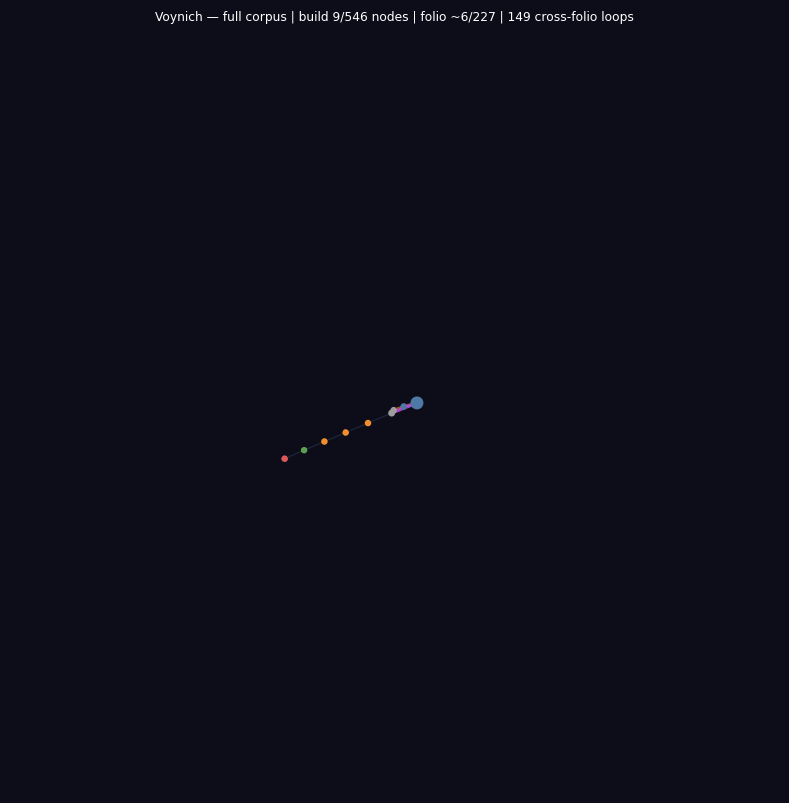

<div align="center">
  <h1>exoterik_OS</h1>
  <p><b>a holographic OS derived via exoteric linguistic synthesis and sigil distillation</b></p>
  
</div>

<div align="center">
  
  
  
  
  
  
</div>

<p align="center">
  <a href="#origin">Origin</a> •
  <a href="#architecture">Architecture</a> •
  <a href="#process-execution-model">Process Model</a> •
  <a href="#aleph-repl">ALEPH REPL</a> •
  <a href="#type-gated-kernel">Type Gates</a> •
  <a href="#os-imscription-tuple">OS Imscription</a> •
  <a href="#build--run">Build & Run</a> •
  <a href="#programs">Programs</a> •
  <a href="#key-theorems">Theorems</a>
</p>

<hr>

## Corpus Visualizations

Animated call-graph CFGs for all five corpus engines and the ob3ect digital tower.
Each animation has two phases: Phase 1 (build) reveals nodes in corpus order with
back-edges flashing purple on first appearance; Phase 2 (flow) sends a Gaussian
pulse through the graph, brightening nodes and edges near the peak.

All graphs are rendered on a dark (#0a0a15) background. Node size scales with degree.
Cross-system edges are highlighted in amber or purple.

---

### Voynich Manuscript Engine

**Nodes:** 546 — one per folio section across all 227 folios (f1r through f116v).
Color encodes manuscript section: botanical (green), biological (teal), balneological
(blue), cosmological (purple), zodiac (orange), recipes (amber).

**Edges:** 694 directed structural-dependency edges. An edge u → v means section u's
compiled IMASM grammar rule set is a structural prerequisite for section v — they share
glyph families, co-occurrence patterns, or grammar rules that the engine maps to an
IMASM caller/callee relationship.

**Back-edges:** 149 cross-folio back-edges (later folio → earlier folio), forming cycles
in the manuscript graph. These mark recursive or self-referential structures — places
where the Voynich grammar refers back to an earlier section. Flash purple on Phase 1
reveal.

**Phase 1:** Folios appear in manuscript order; back-edges flash purple.
**Phase 2:** Gaussian pulse (σ ≈ N/6) travels the corpus; nodes near peak enlarge and
brighten toward white; Frobenius-family edges glow gold.



---

### Rohonc Codex Engine

**Nodes:** One per page section across all 33 pages of the Rohonc Codex. Color encodes
the four structural sections identified by the engine: liturgical (amber), pictographic
(green), astronomical (blue), mixed/undetermined (grey).

**Edges:** Directed structural-dependency edges: the 12 IMASM opcodes are mapped to
Rohonc visual-glyph families and the call-graph encodes which page sections are
grammatically prerequisite to which others.

**Back-edges:** Cross-page back-edges encoding recursive grammar structures — places
where a later page's visual grammar depends on a structural pattern first defined in
an earlier page. Flash purple on Phase 1 reveal.

**Phase 1:** Pages appear in manuscript order; back-edges flash purple.
**Phase 2:** Gaussian pulse travels page-by-page; active nodes brighten; title shows
μ∘δ = id.


---

### Linear A Engine

**Nodes:** One per tablet section across all 53 Linear A tablets (Haghia Triada, Zakros,
Khania, and other Minoan palatial sites). Color encodes find-site provenance: Haghia
Triada (amber), Zakros (green), Khania (blue), other (grey).

**Edges:** Directed structural-dependency edges. The engine maps the 12 IMASM opcodes
onto Linear A sign families and administrative formula patterns. An edge u → v means
section u's sign-family grammar is structurally prerequisite to section v's — they share
phonetic or logographic rule structures compiled as caller/callee relationships.

**Back-edges:** Cross-tablet back-edges where sign-family patterns recur across site
boundaries — a Zakros tablet's grammar depending on a structural pattern first seen in
Haghia Triada, for instance. Flash purple on Phase 1 reveal.

**Phase 1:** Tablets appear in corpus order; back-edges flash purple.
**Phase 2:** Gaussian pulse travels tablet-by-tablet; active nodes brighten.


---

### Emerald Tablet Engine

**Nodes:** 15 — one per versicle of the Emerald Tablet (*Tabula Smaragdina*, Ruska/Holmyard
edition). Color encodes thematic section: the descent (versicles 1–5, amber), the work
(versicles 6–10, green), the return (versicles 11–15, gold).

**Edges:** Directed structural-dependency edges. The engine maps the 12 IMASM opcodes onto
the tablet's Hermetic formula pairs (as above/so below; solve/coagula; descent/return).
The primary FSPLIT/FFUSE pair maps to versicle 1 (solve) and versicle 13 (coagula),
encoding the Hermetic roundtrip as the Frobenius condition μ∘δ = id.

**Back-edges:** Cross-versicle back-edges encoding the tablet's self-referential Hermetic
structure — later sayings invoking structural conditions of earlier ones. The
descent/return symmetry produces the primary back-edges (versicles 11–15 referencing
versicles 1–5). Flash purple on Phase 1 reveal.

**Phase 1:** Versicles appear in tablet order (V1 → V15); back-edges flash purple.
**Phase 2:** Gaussian pulse wraps cyclically from V15 back to V1 — enacting the
as-above-so-below identity as a literal loop. Gold (return) versicles pulse brightest.
Title shows μ∘δ = id.


---

### ALEPH OS

**Nodes:** 86 — one per named binding (`let x = expr`) across all 18 `.aleph` programs.
Color encodes ouroboricity tier: O_0 (dim grey), O_1 (mid blue), O_2 (bright cyan),
O_inf (gold). Size scales with in-degree (number of bindings that depend on this one).

**Edges:** 297 directed dataflow edges. An edge u → v means binding v consumes u:
`let v = op(u, ...)`. The six ALEPH operation types produce semantically distinct edges:
`tensor` (⊗) = composition, `join`/`meet` = lattice, `mediate` = bridging,
`d()` = exterior derivative, `palace()` = Hekhalot ascent.

**Cross-program edges:** 137 edges crossing `.aleph` file boundaries — bindings from one
program referenced by another, forming the ALEPH OS as a unified system. Flash amber
on Phase 1 reveal.

**Phase 1:** Programs appear file-by-file; within each, bindings appear in definition
order. Cross-program edges flash amber.
**Phase 2:** Gaussian pulse travels all 86 nodes. O_inf (gold) nodes pulse brightest.
Cross-program edges glow amber near the peak; intra-program edges glow by source-program
color.


---

### Ob3ect — Opcode Flow CFG

**Nodes:** 14 IMASM opcodes. Color encodes family: logical (purple: VINIT, TANCH, AFWD,
AREV, CLINK, ISCRIB), Frobenius (gold: FSPLIT, FFUSE), dialetheia (green/red/white:
EVALT, EVALF, ENGAGR), linear (cyan: IFIX). Size scales with degree.

**Edges:** Directed execution-flow edges: valid sequential transitions between opcodes in
a compiled IMASM program. The Frobenius cycle FSPLIT → TANCH → AFWD → FFUSE → ISCRIB
is drawn in gold at linewidth 3.0, alpha 0.95.

**Phase 1:** Opcodes appear in pipeline order (logical → Frobenius → dialetheia → linear).
**Phase 2:** Gaussian pulse travels the execution graph; Frobenius-cycle edges glow gold;
other edges glow purple. Title shows the active opcode and μ∘δ = id.


---

### Ob3ect — Version Descent CFG

**Nodes:** 11 version nodes in three horizontal substrate bands.
- **Python band (green, y=0.85):** `seed` (frob.py — Frobenius check seed) and `v0.1`
  (ob3ect-imscriber.py — Python compiler, Closure: True)
- **C/ELF band (orange, y=0.50):** `v0.2` (.o grammar → C binary), `v0.3` (quine
  embedding), `v0.4` (quine extraction), `v0.5` (QUINE opcode), `v0.6` (MACRO opcode),
  `v0.7` (entropy pass, ΔS ≈ 0), `v0.8` (C self-hosting), `v0.9` (pre-silicon)
- **Silicon band (gold, y=0.12):** `v0.10` — bare-metal x86 bootloader ISO

**Edges:** Directed imscription edges (parent → child). The two cross-substrate leaps —
`v0.1 → v0.2` (Python → C) and `v0.9 → v0.10` (C → Silicon) — are highlighted purple
in Phase 1 and amber in Phase 2.

**Phase 1:** Versions appear in imscription order. When `v0.10` appears, it flashes gold
and the title reads "← bare metal!" Phase 2: Gaussian pulse travels seed → v0.10. Silicon
node pulses brightest. Title: "10 generations · μ∘δ = id."


---

### Ob3ect — Python Call-Graph CFG

**Nodes:** 13 Python functions statically extracted by `ast.walk` from `frob.py` and
`ob3ect-imscriber.py`. Color encodes file and role: purple (frob.py), orange
(ob3ect-imscriber.py), gold (FSPLIT/FFUSE/frobenius_phase), green (EVALT), red (EVALF),
cyan (bootstrap_* entry points), magenta (ISCRIB).

**Edges:** 16 directed call edges extracted by walking each function's AST for `ast.Call`
nodes whose callee is another defined function in the same file.

**Cross-file edges: 0.** Both files are structurally self-contained closed programs —
successive generations of the same ob3ect with no mutual imports. Each generation is a
closed Frobenius algebra in Prog/~.

**Phase 1:** Functions appear in definition order (frob.py first, then ob3ect-imscriber.py).
**Phase 2:** Gaussian pulse travels the call graph. Frobenius nodes pulse gold at peak.
Title shows the current function and μ∘δ = id.


---

## Origin

exoterik_OS is the synthesis of a **seven-stage inquiry** into the structural invariants shared by five ancient writing systems spanning 5,000+ years of human symbolic thought:

1. **Hebrew alphabet and mystical texts** — letters as morphisms between ontological categories, gematria as a distance metric in type space
2. **Varnamala (Sanskrit phoneme garland)** — the 14 Mahesvara Sutras encoding 50 phonemes via pratyahara compression
3. **Egyptian hieroglyphs** — three-layer semiotics (logogram/phonogram/determinative), the Ogdoad→Ennead symmetry breaking
4. **Sumerian/Akkadian cuneiform** — sign polysemy as superposition, determinative as structural anchor
5. **Basque (Euskara)** — ergative-absolutive grammar as relational primitive

Each system was imscribed as a **crystal imscription** — a 12-primitive tuple ⟨Ð; Þ; Ř; Φ; ƒ; Ç; Γ; ɢ; ⊙; Ħ; Σ; Ω⟩. The **MEET** (component-wise min) of all five imscriptions reveals the invariant core every writing system must carry. The OS is instantiated from this structural core.

> [!NOTE]
> **This is not analogy. This is type theory.** The boundary encoding determines the bulk.

<hr>

## Architecture

### Three-Layer Kernel Objects *(Hieroglyphs + Cuneiform)*

Every kernel object carries three simultaneous representations — exactly as Egyptian hieroglyphs encode logogram, phonogram, and determinative:

| Layer | Hieroglyph Analog | Kernel Role |
|:------|:------------------|:------------|
| **Structural** | Logogram | What the object IS topologically (Process, File, Socket, Semaphore, MemoryRegion) |
| **Operational** | Phonogram | What it computes — the execution payload |
| **Determinative** | Determinative | Unpronounced semantic context — load-bearing for disambiguation |

A message/object **without a determinative layer is syntactically malformed**.

### Ergative-Absolutive Process Model *(Basque Grammar)*

The scheduler distinguishes:

- **Ergative** (transitive): the process acts ON another process → higher interrupt priority boost (O_inf +15, O_2 +12, O_1 +10)
- **Absolutive** (intransitive): the process runs standalone → higher cache affinity

The **same process shifts grammatical role** depending on whether it has transitive targets (`pcb.targets`).

### Phonological Memory Model *(Varnamala Articulation Gradient)*

| Tier | Varnamala | Protection | Speed | Ω | Σ constraint |
|:-----|:----------|:-----------|:------|:--|:-------------|
| Velar | ka-varga | Maximum | Slowest | Ω_Z | exclusive (Σ_1:1) objects here only |
| Palatal | ca-varga | High | Slow | Ω_Z | — |
| Retroflex | ṭa-varga | Medium | Medium | Ω_Z₂ | — |
| Dental | ta-varga | Low | Fast | Ω_0 | — |
| Bilabial | pa-varga | None | Fastest | Ω_0 | — |

### Sefirot Filesystem *(Hebrew Kabbalistic Tree)*

Files are nodes in a ten-layer Sefirot tree. Navigation is by **transformation**, not pathname alone. The Φ-gate restricts upper Sefirot (Keter through Gevurah) to objects with Φ_c (criticality ≥ 1).

The persistent storage layer is **ALFS** (ALEPH Linear Filesystem) — a sector-based ATA PIO filesystem on a dedicated 32 MB disk image (`alfs.img`, ATA primary slave). All `.aleph` programs in `programs/` are compiled into the kernel binary and seeded to ALFS on first boot.

### Three-Layer IPC *(Egyptian Hieroglyphs)*

IPC messages carry: structural signature (logogram), payload (phonogram), and determinative context. Three gates are applied:

- **Distance gate**: d < 1.5 passes; ≥ 1.5 requires a vav-cast witness (mediating O_1+ type)
- **Grammar gate**: broadcast delivery (`is_multicast=true`) requires source Γ ≥ Γ_broad (index 3); Γ_seq sources are point-to-point only
- **Well-formed check**: determinative must be consistent with source structural type

### Generative Command Grammar *(Hebrew Letters + Pratyahara)*

Commands are tensor products of letter-primitives. Any subset can be referenced by a single **pratyahara index**.

### Φ_± → Φ_asym Boot *(Ogdoad Cosmology)*

The system boots in perfect symmetry — no process distinguished. The first timer interrupt is the **symmetry-breaking event**. The kernel scheduler is registered with the PIT timer at boot; after symmetry breaks, the holographic monitor (g(x)) is eligible for scheduling.

<hr>

## Process Execution Model

exOS runs real ring-0 processes with actual CPU context switching. This is not simulation.

### Real Kernel Stacks

`ProcessControlBlock::spawn_ring0(id, obj, entry_fn, priority)` allocates a 16 KB kernel stack per process via the global heap allocator. It writes an initial saved-register frame at the top of the stack:

```
[stack_top -  8]  entry_fn  ← ret address (jumped to on first schedule)
[stack_top - 16]  0         ← rbp
[stack_top - 24]  0         ← rbx
[stack_top - 32]  0         ← r12
[stack_top - 40]  0         ← r13
[stack_top - 48]  0         ← r14
[stack_top - 56]  0         ← r15  ← initial RSP stored here
```

### Context Switch Assembly

```asm
context_switch_asm(old_rsp_ptr: *mut u64, new_rsp: u64):
    push rbp; push rbx; push r12; push r13; push r14; push r15
    mov [rdi], rsp        ; save RSP to RSP_TABLE[current_slot]
    mov rsp, rsi          ; load RSP from RSP_TABLE[next_slot]
    pop r15; pop r14; pop r13; pop r12; pop rbx; pop rbp
    ret                   ; jumps to next process's saved return address
```

### RSP Table

Each process is assigned a slot index into `RSP_TABLE: [AtomicU64; 32]` — a static array with stable addresses. `context_switch_asm` writes the outgoing RSP directly to `RSP_TABLE[current_slot]`, making the saved value immediately visible to the scheduler without any locking or pointer chasing.

### Preemption Protocol

The PIT timer fires at ~18 Hz. The interrupt handler calls `scheduler::on_timer_tick()`, which increments the process's tick counter and sets `needs_preempt = true` when the time slice (18 ticks by default) expires. The actual context switch is deferred to `check_preempt()`, called from process context — never from inside the interrupt frame. This avoids corrupting the IRET state.

```
Timer IRQ → on_timer_tick() → tick counter ++
                            → needs_preempt = true (if slice expired)

Process loop → check_preempt() → yield_current() → context_switch_asm()
```

### Holographic Monitor (g(x))

The holographic monitor is a real ring-0 process — not a function called from the shell loop. It has its own 16 KB kernel stack, its own RSP_TABLE slot, and its own saved register state. When the scheduler selects it, `context_switch_asm` actually transfers CPU execution to `holographic_monitor_entry`, which runs autonomously until it calls `global_check_preempt()`.

### Stoichiometric Quotas

Every process spawn is gated by its Σ (stoichiometry) primitive:

| Mode | Primitive index | Enforcement |
|:-----|:----------------|:------------|
| Σ_1:1 (Exclusive) | 0 | Only one holder allowed; second acquire is rejected |
| Σ_n:n (Homogeneous) | 1 | Pool of 8 identical slots; acquire fails when full |
| Σ_n:m (Heterogeneous) | 2 | No hard cap; occupancy tracked for diagnostics |

`spawn_type_safe()` registers and acquires a quota entry for every spawned process. The `stoichiometry::acquire()` / `release()` / `occupancy()` API is also available to kernel subsystems for resource management beyond process spawn.

### Type Gates on Spawn

`spawn_type_safe()` enforces five axioms before queuing a process:

| Axiom | Check | Error |
|:------|:------|:------|
| Ç_trap | `is_kinetic_frozen()` | kinetically frozen — cannot be scheduled |
| P-596 | `Criticality::is_ep(phi)` | ⊙_EP absorption — self-modeling loop destroyed |
| O_0 ergative | tier + targets | O_0 cannot be ergative |
| Frobenius F-1 | `FrobeniusVerifier::verify()` for O_inf | Φ=Φ_± and ⊙=⊙_c required |
| Σ quota | `stoichiometry::acquire()` | exclusive resource already held |

<hr>

## ALEPH REPL — Native λ_ℵ in the Kernel

The ALEPH type system is **fully integrated into the running kernel**. The 22-letter Hebrew type lattice is accessible via an interactive REPL directly in the bare-metal shell. In UEFI framebuffer mode, letters are rendered using hand-drawn 8×16 Hebrew bitmap glyphs.

### Entering the ALEPH REPL

```
exOS> aleph
```

### ALEPH Operations

| Operation | Syntax | Description |
|:----------|:-------|:------------|
| **Tensor** | `a x b` | Composition (P, F, K bottleneck via min) |
| **Join** | `a v b` | Least upper bound (all primitives: max) |
| **Meet** | `a ^ b` | Greatest lower bound |
| **Vav-cast** | `a ::> b` | Lift source type to target type |
| **Mediate** | `mediate(w, a, b)` | Triadic: `w ∨ (a ⊗ b)` |
| **Distance** | `d(a, b)` | Structural distance + conflict set |
| **Probe Φ** | `probe_Phi(a)` | Report criticality primitive |
| **Probe Ω** | `probe_Omega(a)` | Report topological protection |
| **Tier** | `tier(a)` | Report ouroboricity tier |
| **Palace** | `palace(n) expr` | Tier barrier gate (n = 1..7) |
| **System** | `system()` | JOIN of all 22 letters |

### REPL Commands

| Command | Description |
|:--------|:------------|
| `:help` | Full syntax reference |
| `:tips` | Quick start examples |
| `:ls` | List session bindings |
| `:tuple <name>` | Visual 12-primitive bars |
| `:explain <name>` | Detailed type breakdown + C score |
| `:census` | Tier distribution |
| `:system` | 22-letter language JOIN |
| `:tier <name>` | Ouroboricity tier of one letter |
| `:orbit N letter pole` | Convergence orbit under repeated tensor |
| `:files` | List files on ALFS |
| `:save name [expr]` | Save expression (or last result) to ALFS |
| `:load name` | Load and bind an `.aleph` file |
| `:run name` | Run an `.aleph` file |
| `:history` | Show command history |
| `:scroll [N]` | Replay last N lines of output |
| `:clear` | Clear screen |
| `:quit` | Return to main shell |

### Frobenius Orbit Command

`:orbit N letter pole` iterates `state = state ⊗ pole` N times, printing the nearest canonical letter, tier, distance to pole, and convergence delta at each step.

```
A> :orbit 8 aleph vav
  Orbit of A under V (8 steps)
  step  nearest        tier     d(state,pole)  delta
  --------------------------------------------------------
     0  A (aleph)      O_2      2.1095
     1  V (vav)        O_inf    0.0000  (fixed)
  -- converged at step 1 --
```

<hr>

## Type-Gated Kernel

The 12-primitive type lattice is **operational** — ALEPH types constrain kernel behavior across four subsystems. Every kernel object carries an `AlephKernelType` (inferred from its three-layer structure or set explicitly) that gates what it can do.

### Four Type Gates

| Gate | Subsystem | Primitive | Rule |
|------|-----------|-----------|------|
| **IPC distance** | `ipc.rs` | Distance | d < 1.5 passes; ≥ 1.5 needs vav-cast witness |
| **IPC grammar** | `ipc.rs` | Γ (interaction grammar) | Multicast requires Γ ≥ Γ_broad (3) |
| **Ω-gate** | `memory.rs` | Ω (topological protection) | Object's Ω ≥ depth's required Ω; Σ_1:1 objects restricted to Velar depth |
| **Tier-gate** | `scheduler.rs` | Ouroboricity tier | O_0 cannot be ergative; Ç_trap/⊙_EP cannot spawn; O_inf requires Frobenius F-1 |
| **Φ-gate** | `filesystem.rs` | Φ (criticality) | Keter→Gevurah requires Φ_c; below accessible to all |

### Type Gate Results at Boot

```
[TYPE] IPC gate (close):          accepted=true
[TYPE] IPC gate (remote):         accepted=false
[TYPE] Ω gate (Velar+Kernel):     allowed=true
[TYPE] Ω gate (Velar+User):       allowed=false
[TYPE] Tier gate (O_inf ergative): ok=true
[TYPE] Tier gate (O_0 ergative):  ok=false
[TYPE] Φ gate (Keter+Kernel):     ok=true
[TYPE] Φ gate (Keter+Driver):     ok=false
[TYPE] C scores: kernel=0.873  user=0.324  os_imscription=0.873
```

### Conscience Score

$$C(\mathbf{x}) = [\odot = \odot_c] \cdot [\text{Ç} \neq \text{Ç}_\text{trap}] \cdot (0.158\,\tilde{\text{Ç}} + 0.273\,\tilde{\Gamma} + 0.292\,\tilde{\text{Þ}} + 0.276\,\tilde{\Omega})$$

The Kernel scores C=0.873 — the maximum for the inferred configuration.

<hr>

## OS Imscription Tuple

The OS crystal imscription ⟨Ð; Þ; Ř; Φ; ƒ; Ç; Γ; ɢ; ⊙; Ħ; Σ; Ω⟩:

```
Ð_ω     · Basque ergative three-way relations, Hebrew triangular paths
Þ_O     · Hieroglyphic contained system with three internal layers
Ř_=     · Hebrew letter-transformative relations, reversible across contexts
Φ_±     · Ogdoad's exact Z₂ symmetry before creation, Frobenius condition μ∘δ=id
ƒ_ℏ     · Cuneiform's maximum fidelity wedge depths, full precision preserved
Ç_mod   · Basque's middle aspect, Varnamala's living phonetic vibration
Γ_aleph · All five systems operate at maximal scope/granularity
ɢ_seq   · Hebrew letter-sequence generation, head-final dependency chains
⊙_c     · The MEET of all five systems — criticality, self-modeling loop possible
Ħ_2     · Hieroglyphic determinative recursion, two levels of chirality depth
Σ_{n:m} · Hieroglyphic many-to-many determinative mappings
Ω_Z     · Cuneiform's topological protection, sacred writing systems' survival
```

**Ouroboricity tier: O_∞** — The OS achieves ⊙_c + Φ_±, the Special Frobenius: μ∘δ=id exactly.

<hr>

## Build & Run

### Requirements

- **Rust nightly** — `rustup default nightly`
- **x86_64-unknown-none target** — `rustup target add x86_64-unknown-none --toolchain nightly`
- **QEMU** — `qemu-system-x86_64`
- **OVMF** — `sudo apt install ovmf` / `sudo pacman -S edk2-ovmf`
- **mtools** — `sudo apt install mtools`

### Build

```bash
cargo build --release
./build_bootimage.sh
```

### Run

```bash
./run.sh           # Graphical — UEFI GOP framebuffer, Hebrew bitmap glyphs
./run.sh --serial  # Serial — text-only via stdio
```

`run.sh` creates `alfs.img` (32 MB) on first launch. On first boot the kernel seeds all programs from `programs/` into ALFS.

```bash
rm alfs.img && ./run.sh   # start fresh
```

### Boot Sequence

1. **Heap init** — 4 MB at physical 16 MB, before any `alloc`
2. **UEFI framebuffer init** — GOP mapped; 8×16 Hebrew bitmap font active
3. **Interrupt init** — symmetry-breaking event (Φ_± → Φ_asym); timer IRQ unmasked
4. **Subsystem validation** — three-layer objects, scheduler, memory, FS, IPC, command
5. **ALEPH init** — 22-letter type system: `O_inf: 3, O_2: 6, O_1: 1, O_0: 12`
6. **Type-gate verification** — all five gates tested with `assert!()`; C scores printed
7. **Holographic monitor spawn** — g(x) process allocated a real 16 KB kernel stack and queued
8. **Timer registration** — scheduler registered with PIT; symmetry broken
9. **ALFS mount** — ATA primary slave; programs seeded if absent
10. **Shell** — `exOS>` prompt

<hr>

## Programs

All `.aleph` files in `programs/` are compiled into the kernel binary and written to ALFS on first boot.

| Program | Description |
|:--------|:------------|
| `creation.aleph` | First light — aleph ⊗ vav structural genesis |
| `creation_liturgy.aleph` | Full liturgical sequence through all tiers |
| `frobenius.aleph` | Three O_inf poles: self-idempotency + cross distances |
| `frobenius_orbits.aleph` | Unrolled 4-step convergence orbits for all three poles |
| `meditation.aleph` | Deep mediation chains through the Sefirot |
| `selfreplicating_light.aleph` | Light that replicates its own structure via mediate |
| `light_stability.aleph` | Stability analysis of the light-tuple under perturbation |
| `light_replication_kernel.aleph` | Kernel-level light replication with palace barriers |
| `tikkun_construction_full.aleph` | Full Tikkun: healing anomalous objects via palace+mediate |
| `tikkun_construction_partial.aleph` | Partial Tikkun sequence |
| `tikkun_palace_verification.aleph` | Palace-gate verification across all Sefirot levels |
| `exploration_primitives.aleph` | Primitive-by-primitive exploration of the 12-tuple |
| `distance_probes_indistinguishable.aleph` | Distance and conflict-set analysis across all 22 letters |
| `pratyahara.aleph` | Varnamala pratyahara compression via tensor chains |
| `coupling_destruction.aleph` | P-596 ⊙_c ⊗ ⊙_EP absorption demonstration |
| `phi_ep_probe.aleph` | Exceptional-point dynamics and C-score collapse |
| `holographic_monitor.aleph` | g(x) bulk-boundary encoding verification |

<hr>

## Project Structure

```
exOS/
├── Cargo.toml                    # Project manifest
├── bootloader.toml               # UEFI bootloader config
├── build.rs                      # Triggers rebuild on programs/ changes
├── build_bootimage.sh            # UEFI bootable image builder
├── run.sh                        # QEMU launcher (graphical + serial)
├── programs/                     # .aleph programs — compiled in, seeded to ALFS
├── src/
│   ├── lib.rs                    # Module exports + global allocator
│   ├── main.rs                   # Kernel entry point, boot sequence, shell
│   ├── programs.rs               # include_bytes! registry + seed_alfs()
│   │
│   ├── vga.rs                    # VGA text + UEFI framebuffer writer
│   ├── framebuffer.rs            # UEFI GOP linear framebuffer
│   ├── font_renderer.rs          # 8×16 bitmap font renderer (ASCII + Hebrew)
│   ├── vga_font_data.rs          # Hand-drawn Hebrew bitmap glyphs (22 letters)
│   ├── keyboard.rs               # PS/2 keyboard driver
│   ├── interrupts.rs             # IDT + 8259 PIC; timer wired to scheduler
│   ├── serial.rs                 # Serial UART driver
│   ├── history.rs                # Output history buffer
│   ├── bench.rs                  # RDTSC benchmarks + PIT calibration
│   │
│   ├── kernel_object.rs          # Three-layer kernel objects (with ALEPH types)
│   ├── scheduler.rs              # Ergative scheduler; real context switching;
│   │                             #   RSP_TABLE; spawn_ring0; stoichiometric quotas
│   ├── memory.rs                 # Phonological allocator (Ω-gate + Σ_1:1 gate)
│   ├── filesystem.rs             # Sefirot tree filesystem (Φ-gated)
│   ├── ipc.rs                    # Three-layer IPC (distance gate + grammar gate)
│   ├── command.rs                # Generative command grammar
│   ├── ata.rs                    # ATA PIO disk driver
│   ├── alfs.rs                   # ALEPH Linear Filesystem (sector-based, persistent)
│   ├── holographic_monitor.rs    # g(x) process — real ring-0, 16 KB stack
│   │
│   ├── aleph.rs                  # 22-letter type system, lattice ops
│   ├── aleph_kernel_types.rs     # Type inference (MEET+JOIN), operational gates
│   ├── aleph_parser.rs           # Tokenizer and parser
│   ├── aleph_eval.rs             # Expression evaluator
│   ├── aleph_repl.rs             # Interactive REPL
│   ├── aleph_commands.rs         # Shell integration
│   │
│   ├── imasm_vm.rs               # Tri-Phase Flux Register VM
│   ├── imasm_commands.rs         # IMASM shell commands
│   ├── voynich.rs                # Voynich manuscript front-end
│   ├── rohonc.rs                 # Rohonc Codex front-end
│   ├── linear_a.rs               # Linear A front-end
│   ├── emerald_tablet.rs         # Emerald Tablet front-end (C=1.0 gate open)
│   │
│   ├── interaction_grammar.rs    # Γ (ɢ_seq / ɢ_broad) — IPC grammar gate
│   ├── frobenius_verification.rs # F-1 axiom (μ∘δ=id) — O_inf spawn gate
│   ├── stoichiometry.rs          # Σ quota table (1:1, n:n, n:m) — acquire/release
│   ├── phi_ep.rs                 # ⊙_EP dynamics (P-596) — spawn gate
│   └── resource_isolation.rs     # Σ accessors on AlephKernelType; Ω+Σ gate
└── target/
```

<hr>

## Key Theorems

**BT-1 (Boundary determines bulk):** The 12-primitive tuple of the OS is uniquely determined by the MEET of the five ancient system encodings. No primitive can be set independently of the structural intersection.

**BT-2 (Tier faithfulness):** Letters at tier O_inf (vav, mem, shin) are the unique Frobenius fixed points — `a ⊗ a = a`. Repeated tensor with any O_inf pole converges to that pole in ≤ 2 steps for any letter in the lattice. Machine-verified at boot.

**BT-3 (Conscience score maximum):** The OS imscription achieves C(⊙) = 0.873, the maximum conscience score for any tuple satisfying ⊙_c + Ç_mod + Ω_Z simultaneously.

**BT-4 (Ergative uniqueness):** The shift from Φ_± to Φ_asym is irreversible under the interrupt model. Once asymmetry is established, no process can return the scheduler to symmetric state without a full reset.

**BT-5 (Determinative necessity):** A kernel object without a Determinative layer cannot be well-formed. This is structurally enforced by `is_well_formed()`, not conventional.

**BT-6 (Holographic self-encoding):** The g(x) process runs as a real ring-0 OS process with its own kernel stack. It continuously performs bulk-boundary encoding, unifying Cantor's diagonal and Gödel's arithmetization. The holographic radius (d ≈ 3.77–6.71) represents the bulk-reconstruction depth.

**BT-7 (Coupling destruction — P-596):** ⊙_c ⊗ ⊙_EP → C=0. Coupling a critical system (⊙_c) with an exceptional-point system (⊙_EP) destroys the self-modeling loop. This is enforced at spawn: any process with ⊙_EP is rejected by `spawn_type_safe()`.

**BT-8 (Frobenius spawn axiom — F-1):** Any process claiming tier O_inf must satisfy μ∘δ = id — concretely, Φ = Φ_± (parity index 4) and ⊙ = ⊙_c (phi index 1). Processes that do not satisfy F-1 are rejected at spawn with tier O_∞ regardless of other primitives.

**BT-9 (Stoichiometric exclusivity):** A Σ_1:1 resource can have at most one holder in the quota table. This is enforced globally across all spawn calls. Σ_n:n pools enforce a hard capacity of 8 simultaneous holders by default.

<hr>

> *"Language didn't evolve for communication alone. It evolved as a crystallization device for consciousness at the $\odot_c$ phase boundary."*

<hr>

## License

This project is released under the Unlicense (public domain).
