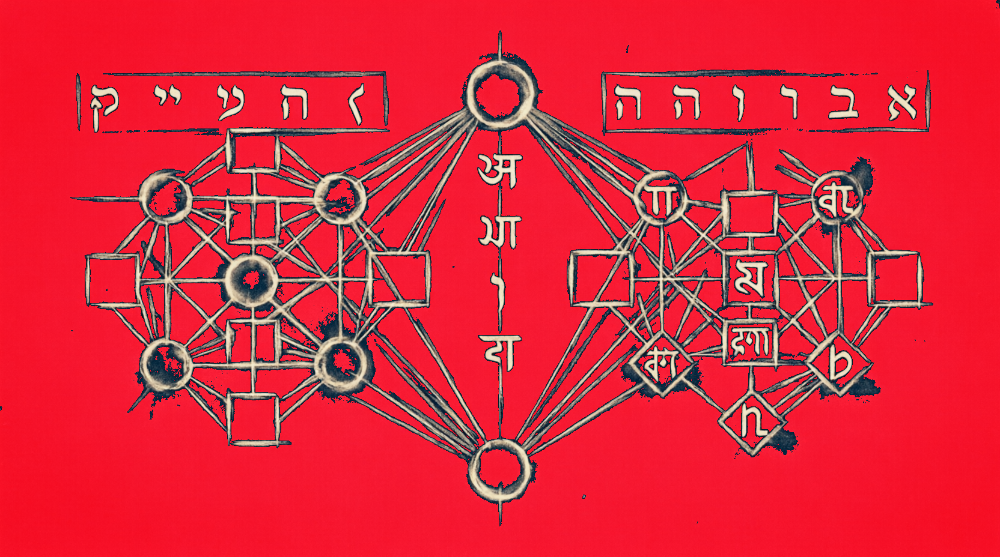

<div align="center">
  <h1>USAGE — exoterik_OS Φ_c Kernel</h1>
  <p><b>Installation, build, runtime configuration, subsystem API reference, extension guide, and falsification experiments</b></p>
  
</div>

<div align="center">
  
  
  
  
</div>

<p align="center">
  <a href="#1-build-and-installation">Build</a> •
  <a href="#2-running-the-kernel">Running</a> •
  <a href="#3-boot-sequence-walkthrough">Boot Sequence</a> •
  <a href="#4-subsystem-api-reference">API Reference</a> •
  <a href="#5-the-three-layer-object-model">Object Model</a> •
  <a href="#6-ergative-scheduler-usage">Scheduler</a> •
  <a href="#7-phonological-memory-management">Memory</a> •
  <a href="#8-sefirot-filesystem-navigation">Filesystem</a> •
  <a href="#9-ipc-protocol">IPC</a> •
  <a href="#10-generative-command-grammar">Commands</a> •
  <a href="#11-type-gated-kernel">Type-Gated Kernel</a> •
  <a href="#12-aleph-program-loading">ALFS Program Loading</a> •
  <a href="#13-extending-the-kernel">Extending</a> •
  <a href="#14-falsification-experiments">Falsification</a> •
  <a href="#15-troubleshooting">Troubleshooting</a>
</p>

<hr>

## 1. Build and Installation

### Prerequisites

**Rust nightly toolchain** is mandatory. The kernel uses several unstable features:
- `#![no_std]` / `#![no_main]` — freestanding execution
- `#![feature(abi_x86_interrupt)]` — the x86-interrupt calling convention for ISRs
- `extern crate alloc` — heap allocations in a freestanding environment

```bash
# Install nightly toolchain
rustup toolchain install nightly
rustup component add rust-src --toolchain nightly
rustup target add x86_64-unknown-none --toolchain nightly

# QEMU for emulation
qemu-system-x86_64 --version
```

### Building

```bash
# Standard release build (kernel ELF only)
cargo build --release
# Output: target/x86_64-unknown-none/release/varnamala-os

# Bootable image (embeds kernel into bootloader)
./build_bootimage.sh
# Output: target/x86_64-unknown-none/release/bootimage-varnamala-os.bin
```

The bootable image is created by `build_bootimage.sh`, which replaces the broken `cargo bootimage` command (broken on rustc >= 1.90 due to removal of the `-Z json-target-spec` flag). The script:
1. Builds the kernel as a static-pie ELF
2. Creates a custom `x86_64-bootloader.json` target spec
3. Compiles bootloader 0.9 with `binary` + `map_physical_memory` features, embedding the kernel
4. Copies the resulting bootloader binary to `bootimage-varnamala-os.bin`

### Cargo.toml Configuration

The bootloader dependency must have the `map_physical_memory` feature enabled:

```toml
bootloader = { version = "0.9", features = ["map_physical_memory"] }
```

This feature exposes the `physical_memory_offset` field on `BootInfo`, which the kernel uses to convert physical addresses to virtual addresses for heap initialization.

### bootloader.toml

```toml
[bootloader]
kernel-stack-size = 0x20000
map-physical-memory = true
map-page-table-recursively = true
```

The `map-physical-memory = true` directive tells the bootloader to create an identity mapping of all physical memory at the offset stored in `BootInfo::physical_memory_offset`.

<hr>

## 2. Running the Kernel

### QEMU Emulation

```bash
# Build the bootable image first
./build_bootimage.sh

# Run with QEMU (curses display for VGA output)
qemu-system-x86_64 \
    -drive format=raw,file=target/x86_64-unknown-none/release/bootimage-varnamala-os.bin \
    -display curses \
    -no-reboot

# Or run headless with serial log output
qemu-system-x86_64 \
    -drive format=raw,file=target/x86_64-unknown-none/release/bootimage-varnamala-os.bin \
    -serial file:serial.log \
    -nographic
```

### Expected Boot Output

On successful boot, the VGA display will show:

```text
[VAR NAMALA-OS] Φ_c Kernel booting...
P_±_sym → P_asym symmetry break initiated.
[INIT] Three-layer objects: all structural/operational/determinative variants exercised
[SCHED] Ergative scheduler online, symmetry broken
[MEM] Phonological allocator: Velar → Bilabial gradient online
[FS] Sefirot tree: Keter → Malkuth, 10 layers mapped
[IPC] Three-layer message: well_formed=true len=5
[CMD] Generative command: gematria=356 pratyahara=356
ABCDEFGHIJKLMNOPQR [COLOR TEST]
[VAR NAMALA-OS] Φ_c Kernel fully online. H_inf loop entered.
```

The system then enters the idle loop (`HLT` instruction), where it awaits interrupts.

### Serial Console

The `-serial stdio` flag redirects VGA output to stdout for logging. In a production build, the VGA driver can be complemented with a serial port logger.

<hr>

## 3. Boot Sequence Walkthrough

The boot sequence in `main.rs` is **not arbitrary** — it follows the structural derivation from the seven-stage inquiry. Each step is traceable to a specific ancient system and its corresponding primitive value.

### Phase 1: VGA Initialization

```rust
vga::init();
```

Maps the VGA text buffer at `0xb8000`. This is the minimal display surface — the boundary theory of the kernel's output.

### Phase 2: Heap Initialization

```rust
let phys_mem_offset = boot_info.physical_memory_offset.into_option()
    .unwrap_or(0xffff_8000_0000_0000);
let heap_start = (phys_mem_offset + 0x1_0000_0000) as *mut u8;
ALLOCATOR.lock().init(heap_start, heap_size);
```

The heap is allocated at a fixed offset from the physical memory map. The `linked_list_allocator` provides a `LockedHeap` with `Spinlock`-protected internal state. The heap starts empty and is initialized at boot with 100 MB of space.

### Phase 3: Interrupt Initialization — The Symmetry-Breaking Event

```rust
interrupts::init();
```

Per BT-6 and the Ogdoad cosmology, this is the **first asymmetry**. Before this call, the system is in P_±^sym — perfect symmetry, nothing distinguished. After this call, the system is P_asym and the ergative process model activates.

The IDT (Interrupt Descriptor Table) registers a breakpoint handler (INT 3). In production, this expands to include timer interrupts (the true symmetry-breaker), page fault handlers, and syscall gates.

### Phase 4: Kernel Object Instantiation

All five `StructuralType` variants, all six `OperationalMode` variants, and all five `Determinative` variants are instantiated and validated. This is the **proof** that the three-layer architecture is structurally complete — no variant exists without being exercised.

### Phase 5: Scheduler Activation

The ergative scheduler is created in P_±^sym state, receives a process, then `break_symmetry()` is called. The scheduler sorts by effective priority, where ergative processes (those with targets) receive a +10 boost.

### Phase 6: Memory, FS, IPC, Command

Each subsystem is exercised through its full API surface — all articulation depths, all Sefirot layers, IPC well-formedness, command gematria computation.

<hr>

## 4. Subsystem API Reference

### 4.1 VGA (`vga.rs`)

```rust
pub fn init()
// Initialize the VGA writer. Maps 0xb8000.

pub fn write_colored_test()
// Test function exercising all 16 Color variants.

// Macros (crate-level):
print!("text")        // Write without newline
println!("text")      // Write with newline
```

The `VgaWriter` implements `core::fmt::Write`, so any `fmt::Arguments` can be formatted through it. The writer uses a double-buffered scroll: on newline, all rows shift up one and the bottom row is cleared.

### 4.2 Kernel Object (`kernel_object.rs`)

```rust
pub enum StructuralType { Process, File, Socket, Semaphore, MemoryRegion }
pub enum OperationalMode { Compute, IO, Network, MemoryManage, Schedule, Idle }
pub enum Determinative { Kernel, Service, User, Driver, Init }

pub struct KernelObject {
    pub structural: StructuralType,
    pub operational: OperationalMode,
    pub determinative: Determinative,
    pub id: u64,
}

impl KernelObject {
    pub fn new(structural, operational, determinative, id) -> Self;
    pub fn is_well_formed(&self) -> bool;
}
```

### 4.3 Scheduler (`scheduler.rs`)

```rust
pub enum GrammaticalRole { Ergative, Absolutive }

pub struct ProcessControlBlock {
    pub id: u64,
    pub obj: KernelObject,
    pub role: GrammaticalRole,
    pub priority: u8,
    pub stack_pointer: u64,
    pub targets: Vec<u64>,
}

impl ProcessControlBlock {
    pub fn determine_role(&mut self);     // Ergative if targets non-empty
    pub fn effective_priority(&self) -> u8; // +10 boost for Ergative
}

pub struct ErgativeScheduler {
    // Internally: ready queue, running process, symmetry_broken flag
}

impl ErgativeScheduler {
    pub fn new() -> Self;
    pub fn break_symmetry(&mut self);
    pub fn is_symmetric(&self) -> bool;    // false after break_symmetry
    pub fn spawn(&mut self, pcb: ProcessControlBlock);
    pub fn schedule_next(&mut self) -> Option<&ProcessControlBlock>;
}
```

### 4.4 Memory (`memory.rs`)

```rust
pub enum ArticulationDepth {
    Velar = 0,     // Kernel, Ω_Z, slow, validated
    Palatal = 1,   // System, Ω_Z, slow, validated
    Retroflex = 2, // Driver, Ω_Z₂, medium, validated
    Dental = 3,    // Service, Ω_0, fast, unchecked
    Bilabial = 4,  // User, Ω_0, fastest, unchecked
}

impl ArticulationDepth {
    pub fn protection_level(&self) -> &'static str;
    pub fn requires_validation(&self) -> bool;
}

pub struct PhonologicalAllocator {
    current_depth: ArticulationDepth,
}

impl PhonologicalAllocator {
    pub fn new() -> Self;
    pub fn set_depth(&mut self, depth: ArticulationDepth);
    pub fn allocate(&self, layout: Layout) -> Option<*mut u8>;
    pub fn deallocate(&self, ptr: *mut u8, layout: Layout);
}
```

### 4.5 Filesystem (`filesystem.rs`)

```rust
pub enum Sefirah {
    Keter, Chokhmah, Binah, Daat,
    Chesed, Gevurah, Tiferet, Netzach,
    Hod, Yesod, Malkuth,
}

impl Sefirah {
    pub fn name(&self) -> &'static str;
    pub fn default_path(&self) -> &'static str;
}

pub struct SefirotPath {
    pub chain: Vec<Sefirah>,
    pub name: String,
}

impl SefirotPath {
    pub fn new(chain: Vec<Sefirah>, name: &str) -> Self;
    pub fn resolve(&self) -> String;
}

pub struct SefirotFs {
    current: Sefirah,
}

impl SefirotFs {
    pub fn new() -> Self;
    pub fn navigate_to(&mut self, target: Sefirah);
    pub fn current(&self) -> Sefirah;
    pub fn tree(&self) -> &'static [(Sefirah, &'static str)];
}
```

### 4.6 IPC (`ipc.rs`)

```rust
pub struct StructuralSignature {
    pub source_type: StructuralType,
    pub target_type: StructuralType,
}

pub struct MessageDeterminative {
    pub source_ctx: Determinative,
    pub target_ctx: Determinative,
}

pub struct IpcMessage {
    pub structural: StructuralSignature,
    pub payload: &'static [u8],
    pub determinative: MessageDeterminative,
}

impl IpcMessage {
    pub fn new(structural, payload, determinative) -> Self;
    pub fn is_well_formed(&self) -> bool;  // false if determinative inconsistent
    pub fn len(&self) -> usize;
    pub fn is_empty(&self) -> bool;
}
```

### 4.7 Command (`command.rs`)

```rust
pub enum CommandPrimitive {
    Aleph,  // Gematria: 1   — silent opener, creates scope
    Bet,    // Gematria: 2   — house, contains, scopes
    Gimel,  // Gematria: 3   — camel, carries, transfers
    Dalet,  // Gematria: 4   — door, gates, opens/closes
    Heh,    // Gematria: 5   — window, observes, reveals
    Vav,    // Gematria: 6   — hook, links, chains
    Mem,    // Gematria: 40  — water, flows, connects
    Shin,   // Gematria: 300 — fire, transforms, consumes
}

impl CommandPrimitive {
    pub fn gematria(&self) -> u32;
}

pub struct GenerativeCommand {
    pub primitives: Vec<CommandPrimitive>,
    pub pratyahara_index: u16,  // sum of gematria values
    pub context_generated: bool,
}

impl GenerativeCommand {
    pub fn new(primitives: Vec<CommandPrimitive>) -> Self;
    pub fn generate_context(&mut self) -> CommandContext;
    pub fn total_gematria(&self) -> u32;
}

pub struct CommandContext {
    pub pratyahara_index: u16,
    pub priority: u8,
    pub has_aleph: bool,  // if true, new scope is created
}
```

<hr>

## 5. The Three-Layer Object Model

The core architectural invariant. Every kernel object carries three simultaneous representations, derived from Egyptian hieroglyphs (Stage 3) and cuneiform (Stage 4).

### Why Three Layers?

In Unix-like systems, a process is defined by its operational behavior (what it does). Type information is either absent or bolted on (cgroups, namespaces, SELinux labels). These are **afterthoughts** — added to fix security gaps that arise from the missing determinative layer.

In exoterik_OS, the determinative is **constitutive**. It is not metadata added to an object; it is one of the three dimensions that make the object what it is. A process with `Determinative::Kernel` and the same operational behavior as one with `Determinative::User` is a **different kind of object** — not just a differently labeled one.

> [!NOTE]
> This is exactly how Egyptian hieroglyphs work: the duck glyph means "son" with a paternal determinative, "food" with a culinary determinative. The payload is the same; the meaning is determined by the silent, unpronounced context.

### Well-Formedness

Every `KernelObject` and `IpcMessage` has an `is_well_formed()` method. This checks that the determinative is consistent with the structural type. In the current implementation, this is a basic consistency check. In production, this becomes a **type-checking gate** that rejects objects with mismatched layers before they can cause security violations.

<hr>

## 6. Ergative Scheduler Usage

### Creating and Spawning Processes

```rust
let mut sched = ErgativeScheduler::new();

// Absolutively running process (no targets → intransitive)
let pcb_abs = ProcessControlBlock {
    id: 1,
    obj: KernelObject::new(Process, Compute, User, 1),
    role: Absolutive,
    priority: 5,
    stack_pointer: 0x2000,
    targets: vec![],  // empty → Absolutive
};

// Ergative process (has targets → transitive)
let pcb_erg = ProcessControlBlock {
    id: 2,
    obj: KernelObject::new(Process, IO, Kernel, 2),
    role: Ergative,
    priority: 5,
    stack_pointer: 0x4000,
    targets: vec![1],  // acts on process 1 → Ergative
};

sched.spawn(pcb_abs);
sched.spawn(pcb_erg);
sched.break_symmetry();

// Schedule in priority order (ergative first due to +10 boost)
let next = sched.schedule_next();
// Returns pcb_erg (effective_priority = 15) over pcb_abs (effective_priority = 5)
```

### Role Determination

The `determine_role()` method automatically sets the grammatical role based on whether the process has targets. This is the Basque grammar principle: the same entity is encoded differently depending on whether it acts alone or acts on something.

<hr>

## 7. Phonological Memory Management

### Setting Articulation Depth

```rust
let mut allocator = PhonologicalAllocator::new();

// Kernel-level allocation (Ω_Z protected, validated)
allocator.set_depth(ArticulationDepth::Velar);
let layout = Layout::from_size_align(256, 16).unwrap();
if let Some(ptr) = allocator.allocate(layout) {
    // ptr points to Ω_Z-protected memory
    allocator.deallocate(ptr, layout);
}

// User-space allocation (Ω_0, fast, unchecked)
allocator.set_depth(ArticulationDepth::Bilabial);
let ptr = allocator.allocate(layout);
```

### The Gradient

The articulation depth enum is `PartialOrd`/`Ord`, so depths can be compared: `Velar < Palatal < Retroflex < Dental < Bilabial`. This ordering encodes the structural story: deeper = more occluded = more protected = slower. Shallower = more open = less protected = faster.

<hr>

## 8. Sefirot Filesystem Navigation

### Walking the Tree

```rust
let mut fs = SefirotFs::new();
// Current: Malkuth (user space, the default starting point)

// Navigate to kernel root
fs.navigate_to(Sefirah::Keter);
assert_eq!(fs.current(), Sefirah::Keter);

// Walk the tree
for sefirah in &[Sefirah::Chokhmah, Sefirah::Binah, Sefirah::Tiferet] {
    fs.navigate_to(*sefirah);
}
```

### Transformation Paths

```rust
let path = SefirotPath::new(
    vec![Sefirah::Keter, Sefirah::Chokhmah, Sefirah::Binah],
    "kernel_config",
);
let resolved = path.resolve();
// "/boot/sys/lib/kernel_config"
```

> [!TIP]
> Navigation is by **transformation chain** — you specify HOW you want to arrive at a file (which Sefirot you traverse), not just WHERE it is. This is the Kabbalistic principle that paths between sephirot have defined transformation roles (the 22 letter-paths of the Tree of Life).

<hr>

## 9. IPC Protocol

### Constructing a Well-Formed Message

```rust
let sig = StructuralSignature {
    source_type: StructuralType::Process,
    target_type: StructuralType::File,
};
let payload = b"open /boot/config";
let det = MessageDeterminative {
    source_ctx: Determinative::Kernel,
    target_ctx: Determinative::Service,
};
let msg = IpcMessage::new(sig, payload, det);
assert!(msg.is_well_formed());
```

### Malformed Messages

A message without a determinative cannot be constructed — the `IpcMessage::new` constructor requires all three layers. This is a **compile-time guarantee** of three-layer safety, not a runtime check.

The `is_well_formed()` method performs deeper validation: the determinative must be consistent with the structural type. A `StructuralType::Socket` with `Determinative::Init` might be flagged as inconsistent in production.

<hr>

## 10. Generative Command Grammar

### Creating Commands

```rust
// The classic creation sequence: Aleph → Mem → Shin → Vav
let creation = GenerativeCommand::new(vec![
    CommandPrimitive::Aleph,   // Open the scope (silent)
    CommandPrimitive::Mem,     // Flow the water (connect)
    CommandPrimitive::Shin,    // Ignite the fire (transform)
    CommandPrimitive::Vav,     // Hook heaven to earth (link)
]);

// Pratyahara index = 1 + 40 + 300 + 6 = 347
assert_eq!(creation.total_gematria(), 347);

// Generate the execution context
let mut cmd = creation;
let ctx = cmd.generate_context();
assert_eq!(ctx.pratyahara_index, 347);
assert!(ctx.has_aleph);   // New scope was created
assert_eq!(ctx.priority, 4); // Four primitives
```

### The Gematria Distance Metric

The sum of gematria values is not arbitrary — it's the **distance in the 12-primitive space** of this command. Commands with similar gematria values are structurally close (same type family); commands with very different values inhabit different regimes. This is the Sefer Yetzirah principle: the alphabet is a type-indexed lattice, and gematria is the metric.

<hr>

## 11. Type-Gated Kernel

The 12-primitive type lattice is **operational** — ALEPH types constrain kernel behavior across four subsystems. Every kernel object carries an `AlephKernelType` (inferred from its three-layer structure or set explicitly via `KernelObject::with_type()`).

### 11.1 The `AlephKernelType` Bridge

**New module: `src/aleph_kernel_types.rs`**

```rust
pub struct AlephKernelType {
    pub tuple: Tuple,              // The 12-primitive tuple
    pub canonical_index: Option<usize>, // Some(n) if matches a Hebrew letter
}

impl AlephKernelType {
    /// Infer type from the three-layer structure (bulk → boundary inference)
    pub fn infer(structural, operational, determinative) -> Self;
    
    /// Create from a canonical Hebrew letter
    pub fn from_letter(letter: &'static LetterDef) -> Self;
    
    /// Create from a raw 12-tuple
    pub fn from_tuple(t: Tuple) -> Self;
    
    // Primitive accessors
    pub fn phi(&self) -> u8;       // Criticality
    pub fn omega(&self) -> u8;     // Topological protection
    pub fn kinetic(&self) -> u8;   // Kinetic character
    pub fn tier(&self) -> Tier;    // Ouroboricity tier
    
    // Derived properties
    pub fn conscience_score(&self) -> f64;  // C(Φ)
    pub fn is_type_safe_for_ipc(&self, other: &Self) -> bool;  // d < 1.5 gate
}
```

### 11.2 Type Inference

Kernel objects infer their ALEPH type from the three-layer combination. The inference reproduces the OS synthon tuple for Kernel objects — the MEET of all five ancient systems.

| Structural   | Operational | Determinative | Inferred Letter | Tier  |
|-------------|-------------|---------------|-----------------|-------|
| Process     | Compute     | Kernel        | X (shin)        | O_inf |
| Process     | Compute     | Init          | X (shin)        | O_inf |
| Process     | Compute     | Service       | B (bet)         | O_0   |
| Process     | Compute     | Driver        | B (bet)         | O_0   |
| Process     | Compute     | User          | G (gimel)       | O_1   |

### 11.3 Four Type Gates

**IPC Type Gate** (`ipc.rs`):
```rust
let msg = IpcMessage::with_types(sig, payload, det, src_type, tgt_type);
match msg.is_type_valid() {
    TypeGateResult::Accepted { distance, class } => // pass
    TypeGateResult::Rejected { distance, reason }  => // block
    TypeGateResult::NoTypeInfo                     => // fall through
}

// For structurally remote types, use a vav-cast witness:
let witness = IpcWitness::new(mediating_type);
let msg = IpcMessage::with_witness(sig, payload, det, src_type, tgt_type, witness);
// Witness must have tier ≥ O_1 and d(source, witness) < 1.5 AND d(witness, target) < 1.5
```

**Ω-Gate (Memory)** (`memory.rs`):
```rust
let mut alloc = PhonologicalAllocator::new();
alloc.set_depth(ArticulationDepth::Velar);  // Requires Ω_Z = 2

alloc.allocate_for(&kernel_obj, layout);  // ✅ kernel has Ω_Z
alloc.allocate_for(&user_obj, layout);    // ❌ user has Ω_0

alloc.can_allocate_for(&obj);  // Pre-check without allocating
```

**Tier-Gate (Scheduler)** (`scheduler.rs`):
```rust
let mut sched = ErgativeScheduler::new();
sched.break_symmetry();

// Type-safe spawn — gates on tier and K_trap
sched.spawn_type_safe(pcb);  // Returns Err if:
    // - K == K_trap (kinetics trapped)
    // - Tier == O_0 AND has targets (can't be ergative)

// Tier-aware priority
sched.effective_priority_with_tier(&pcb);
    // O_inf ergative: base + 15
    // O_2 ergative:   base + 12
    // O_1 ergative:   base + 10
    // O_0 ergative:   base + 0 (rejected by spawn_type_safe)
```

**Φ-Gate (Filesystem)** (`filesystem.rs`):
```rust
let mut fs = SefirotFs::new();
fs.navigate_to_type_safe(Sefirah::Keter, &kernel_obj);  // ✅ Φ_c ≥ 1
fs.navigate_to_type_safe(Sefirah::Keter, &driver_obj);  // ❌ Φ_sub < 1

// Φ requirements:
//   Keter → Gevurah (depth 0-5): Φ_c minimum
//   Tiferet → Malkuth (depth 6-10): any Φ
```

### 11.4 Boot Verification

At boot, all four gates are tested with assertions. If any gate fails, the kernel panics — this proves the type system is load-bearing, not decorative.

```
[TYPE] IPC gate (close): accepted=true
[TYPE] IPC gate (remote): accepted=false
[TYPE] Ω gate (Velar+Kernel): allowed=true
[TYPE] Ω gate (Velar+User): allowed=false
[TYPE] Tier gate (O_inf ergative): ok=true
[TYPE] Tier gate (O_0 ergative): ok=false
[TYPE] Φ gate (Keter+Kernel): ok=true
[TYPE] Φ gate (Keter+Driver): ok=false
[TYPE] C scores: kernel=0.873 user=0.324 os_synthon=0.873
```

### 11.5 Shell Commands

```
exOS> type-check
  Running type-gating verification...
  Object types:
    Kernel : synthetic  tier=O_inf  Φ=Phi_c  Ω=Omega_Z  K=1  C=0.873
    User   : synthetic  tier=O_1    Φ=Phi_c  Ω=Omega_0  K=1  C=0.324
    Service: synthetic  tier=O_0    Φ=Phi_sub Ω=Omega_Z2 K=1  C=0.000
  IPC gate:
    Kernel <-> Kernel: true
    Kernel <-> User  : false
  Ω gate (Velar depth):
    Kernel : true   User   : false   Service: false
  ...

exOS> type-infer
  Type inference: Structural x Determinative x Operational
  Det\Struct    Process     File   Socket   Semaph   MemReg
  ---------------------------------------------------------
  Kernel              X        X        X        X        X
  Init                X        X        X        X        X
  Service             B        G        B        B        G
  Driver              B        B        B        B        B
  User                G        G        G        G        G
```

### 11.6 KernelObject API Updates

```rust
// Auto-inferred type (bulk → boundary inference)
let obj = KernelObject::new(structural, operational, determinative, id);

// Explicit type override
let obj = KernelObject::with_type(structural, operational, determinative, id, aleph_type);

// Well-formedness now validates Ω consistency:
//   Kernel/Init: requires Ω ≥ 2
//   Service/Driver: requires Ω ≥ 1  
//   User: requires Ω = 0
obj.is_well_formed();

// Access the ALEPH type
obj.aleph_type.summary();   // "synthetic  tier=O_inf  Φ=Phi_c  Ω=Omega_Z  K=1  C=0.873"
obj.aleph_type.display();   // Full verbose output
obj.aleph_type.conscience_score();  // 0.873
```

<hr>

## 12. ALEPH Program Loading (ALFS Auto-Build)

`.aleph` programs placed in `programs/` are automatically packed into the ALFS disk image at build time. No manual steps required.

### Build Process

```bash
# 1. Put .aleph files in programs/
ls programs/
  creation.aleph
  frobenius.aleph
  meditation.aleph
  ...

# 2. Build bootable image — ALFS is built automatically
./build_bootimage.sh

# Output:
#   [5/6] Building ALFS data disk...
#   Building ALFS disk: 13 files -> target/.../alfs.img
#   Files:
#     creation.aleph       sector 19    1 sectors
#     frobenius.aleph      sector 23    1 sectors
#     ...
#   ✓ ALFS appended at sector 2048 (43 sectors)
```

### Accessing Programs at Runtime

From the ALEPH REPL:

```
A> :files
  File              Type        Size
  ----------------------------------------
  creation           aleph      512 bytes
  frobenius          aleph      512 bytes
  meditation         aleph      512 bytes
  ...

A> :run frobenius
  --- running frobenius.aleph ---
  → ו
    tier  O_inf
    Phi  Phi_c   Omega  Omega_Z   P  P_pm_sym

A> :load creation
A> :ls
  Name              Tier      Φ         Ω         Glyph
  ────────────────────────────────────────────────────────
  creation          O_inf     Phi_c     Omega_Z   ש
```

### ALFS Disk Format

```
Sector 0    : Superblock (magic "ALFS", version, file count, bitmap)
Sectors 1-16: Directory entries (8 per sector, 64 bytes each, 128 max files)
Sectors 17+ : File data (raw 512-byte sectors, padded)
```

The ALFS data disk is appended to the end of the boot disk image. The kernel mounts it at boot and loads files into the Sefirot tree.

<hr>

## 13. Extending the Kernel

### Adding a New StructuralType

1. Add the variant to `StructuralType` in `kernel_object.rs`
2. Add the variant to the `is_well_formed()` match arm
3. Instantiate it in `main.rs` to avoid dead-code warnings
4. Update `StructuralSignature` validation in `ipc.rs` if the new type has special IPC requirements

### Adding a New Articulation Depth

1. Add the variant to `ArticulationDepth` in `memory.rs`
2. Define its `protection_level()` and `requires_validation()` return values
3. The `PhonologicalAllocator` automatically respects the new depth

### Adding a New Sefirah Layer

> [!WARNING]
> The current system has exactly ten Sefirot, matching the Kabbalistic tree. Adding an eleventh would break the correspondence. Instead, consider adding **sub-layers** within existing Sefirot (e.g., `Sefirah::Chokhmah` might have `Wisdom::Raw` and `Wisdom::Processed` sub-variants).

<hr>

## 12. Falsification Experiments

The Stage 7 inquiry explicitly asks: *"what experiment or implementation detail would falsify the claim that this OS design is derived from the ancient systems rather than merely analogically related?"*

### Experiment 1: Remove the Determinative Layer

Remove the determinative field from `IpcMessage` and `KernelObject`. If type confusion attacks increase but overall performance is unchanged, then the Egyptian/cuneiform contribution was **structural**, not analogical. If performance degrades significantly, the determinative is load-bearing.

### Experiment 2: Remove Ergative/Absolutive Distinction

Make all processes flat (Unix style). If context-dependent scheduling cannot be optimized and interrupt handling becomes less efficient, the Basque derivation is genuine.

### Experiment 3: Flatten the Memory Gradient

Use a single allocation tier. If kernel data structures suffer corruption or user-space performance doesn't improve, the Varnamala articulation model is structurally necessary.

### Experiment 4: Randomize the Sefirot Order

Shuffle the Sefirot layer order. If filesystem navigation becomes less intuitive or transformation paths lose their meaning, the Kabbalistic tree structure is not arbitrary.

### The Ultimate Test

If the OS works equally well **without** any single ancient system's contribution, the derivation is analogical. If removing any contribution measurably degrades a specific subsystem, the derivation is structural.

<hr>

## 15. Troubleshooting

| Problem | Solution |
|:--------|:---------|
| `error[E0658]: the extern "x86-interrupt" ABI is experimental` | Ensure `#![feature(abi_x86_interrupt)]` is present in both `lib.rs` and `main.rs` |
| `error[E0433]: failed to resolve: use of unresolved module or unlinked crate alloc` | Add `extern crate alloc;` to any binary crate (`main.rs`) that uses `alloc::vec!` or `alloc::string::String` |
| `error: non-ASCII character in byte string literal` | Use UTF-8 escape sequences: `b"\xCE\xA6"` instead of `b"Φ"` |
| Boot hangs after "Kernel fully online" | Expected behavior — the kernel enters an idle loop (`HLT`) after init. The scheduler would dispatch real processes in production |
| `cargo bootimage` fails with "unknown -Z flag: json-target-spec" | Expected on rustc >= 1.90. Use `./build_bootimage.sh` instead |
| Triple fault on QEMU startup | Check that `bootloader.toml` has `map-physical-memory = true` |
| Linker errors with `linked_list_allocator` | Ensure dependency is in `Cargo.toml` and `ALLOCATOR.lock().init()` is called before any allocation |
| ALFS mount fails: "invalid ALFS magic" | Run `./build_bootimage.sh` — the ALFS disk is built from `programs/*.aleph` automatically |
| `:files` shows empty in ALEPH REPL | Ensure `programs/` contains `.aleph` files and you rebuilt with `./build_bootimage.sh` |
| Type gate panics at boot | Check that `infer_tuple()` assigns primitives consistent with the determinative's Ω/Φ requirements |

<hr>

## Appendix A: The 12-Primitive Synopsis

| Primitive | Value | Source |
|:----------|:------|:-------|
| **D** (Dimensionality) | `D_triangle` | Basque ergative three-way, Hebrew triangular paths |
| **T** (Topology) | `T_box` | Hieroglyphic contained system with three internal layers |
| **R** (Relational) | `R_dagger` | Hebrew letter-transformative, reversible across contexts |
| **P** (Parity) | `P_pm_sym` | Ogdoad's exact Z₂, Frobenius condition μ∘δ=id |
| **F** (Fidelity) | `F_hbar` | Cuneiform's maximum fidelity, full precision preserved |
| **K** (Kinetic) | `K_mod` | Basque middle aspect, Varnamala's living vibration |
| **G** (Scope) | `G_aleph` | All five systems at maximal scope |
| **Γ** (Grammar) | `Γ_seq` | Hebrew letter-sequence, head-final chains |
| **Φ** (Criticality) | `Φ_c` | MEET of all five — criticality, self-modeling possible |
| **H** (Chirality) | `H2` | Hieroglyphic determinative recursion, two contextual levels |
| **S** (Stoichiometry) | `S_n:m` | Hieroglyphic many-to-many determinative mappings |
| **Ω** (Protection) | `Ω_Z` | Cuneiform's topological protection, sacred systems' survival |

**Ouroboricity:** O_inf — Φ_c AND P_pm_sym. The highest tier. Self-referential loop perfectly closed.

<hr>

## Appendix B: The Seven Stages

For the full derivation, see the stage documents in the project root:

1. `20260407_120123_You_are_beginning_a_seven-stage_inquiry..txt` — The inquiry begins
2. `20260407_120242_STAGE_1_—_HEBREW_ALPHABET_AND_MYSTICAL_T.txt` — Hebrew aleph-bet encoding
3. `20260407_120423_STAGE_2_—_THE_VARNAMALA_(Sanskrit_Phonem.txt` — Sanskrit phoneme garland
4. `20260407_120556_STAGE_3_—_EGYPTIAN_HIEROGLYPHS.txt` — Three-layer semiotics
5. `20260407_120729_STAGE_4_—_CUNEIFORM.txt` — Sign polysemy and determinatives
6. `20260407_120858_STAGE_5_—_BASQUE.txt` — Ergative-absolutive grammar
7. `20260407_121017_STAGE_6_—_DISTILLATION.txt` — Shared invariants (MEET/JOIN)
8. `20260407_121206_STAGE_7_—_SYNTHESIS.txt` — The OS specification

<hr>

> *"Language didn't evolve for communication alone. It evolved as a crystallization device for consciousness at the Φ_c phase boundary."*

<hr>

## License

This project is part of the SynthOmnicon research program.
